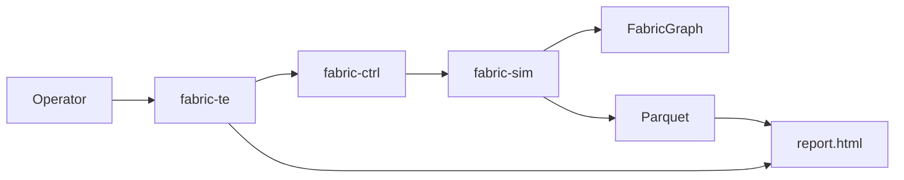
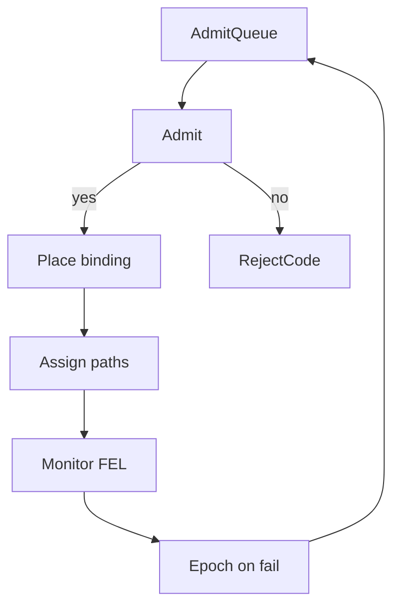
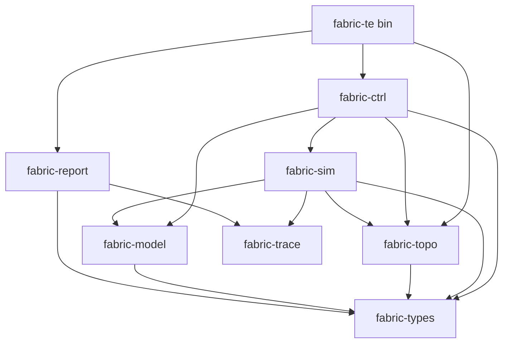
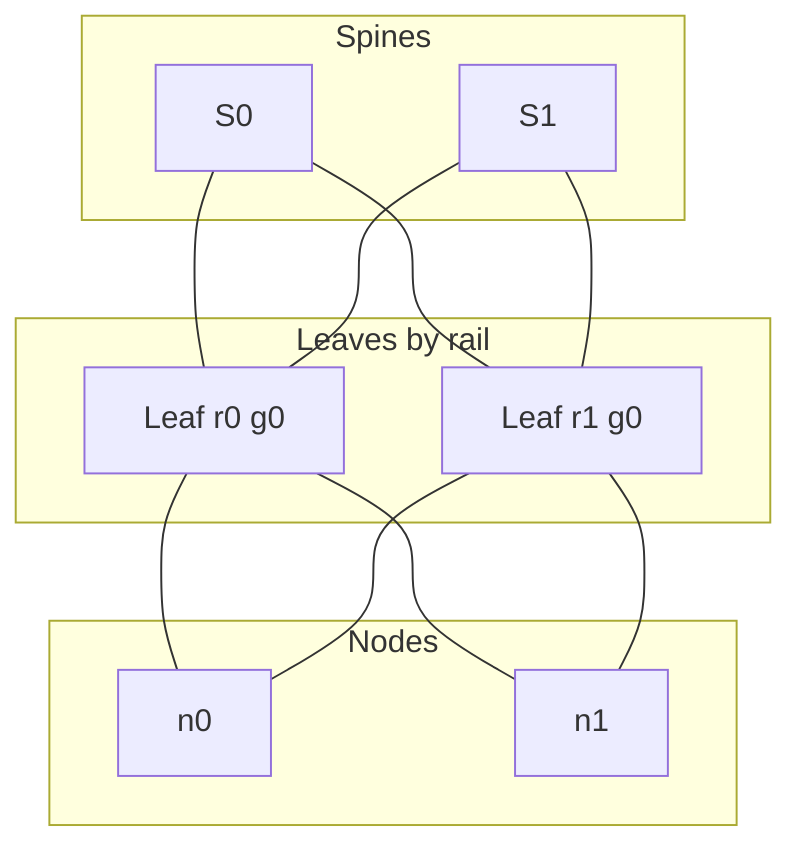
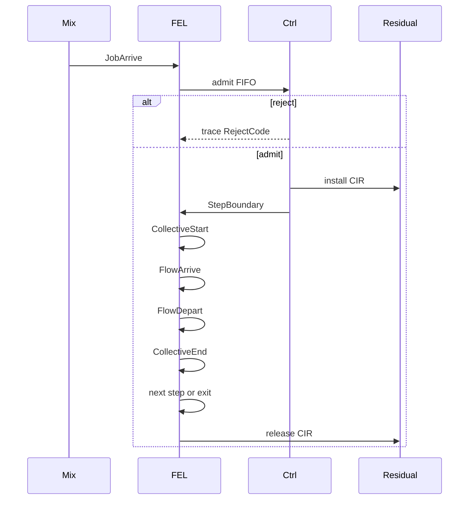
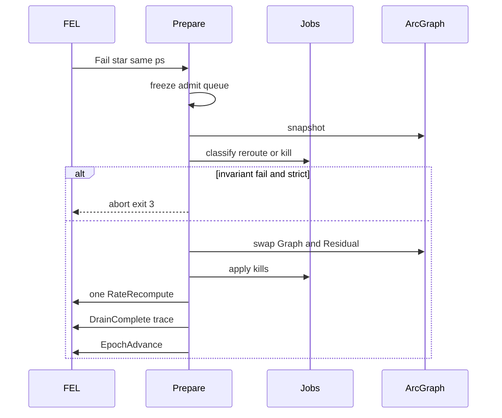
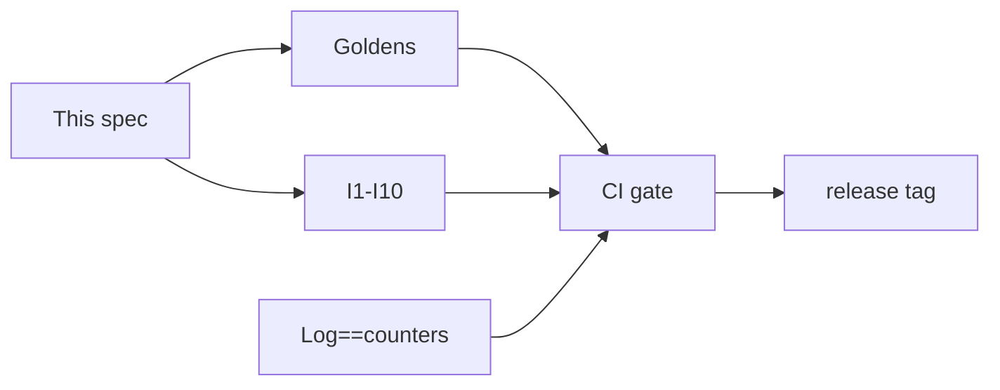
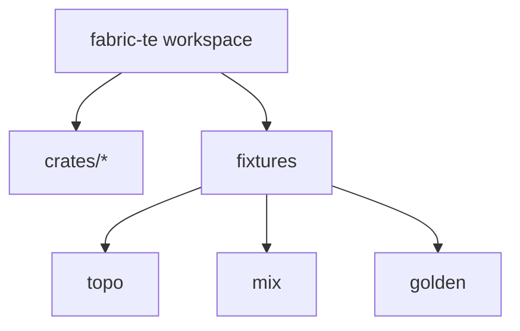
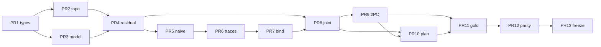

# fabric-te Design Lock (v1)

## 1. Title & Metadata

| Field | Value |
| --- | --- |
| Title | fabric-te: flow-level DES and joint placement / path admission for a simulated GPU-training fabric |
| Author | Champ-Pacifique Mukiza |
| Date | 2026-08-17 |
| Status | Draft |
| Version | 0.1 |
| Audience | Staff+ cluster-networking engineers |
| Role of this document | Week-1–3 design lock. Source of truth. After freeze, implementation is transcription. Code may not invent topology, costing, admission, or CLI. |

**One-sentence scope.** This is a terrestrial datacenter fabric controller (placement + TE + admission + failure + planner) on a flow-level discrete-event simulator. It is a portable fabric-control skill, not a space product.

---

## 2. Overview

Training jobs miss SLOs on fabrics that still have free GPUs. The miss is structural: Ring AllReduce and pairwise AllToAll are barrier-synchronous, rail-aligned, and last-flow-limited. Packing GPUs and spraying ECMP ignores leftover CIR on rails, leaf-spine uplinks, and the incast that appears at step boundaries.

**fabric-te** is a single-binary, single-threaded, deterministic flow-level DES plus two controllers (naive, joint) and a planner that is the same engine under a capacity delta. The joint controller enumerates a bounded set of rank-aligned GPU bindings, costs residual-aware k-shortest paths, water-fills rates, and admits the cheapest binding whose predicted collective time meets the job SLO on leftover CIR. Naive first-fit + hop-count ECMP is the baseline that is allowed to violate the network SLO. Failures swap an `Arc` graph through a 2PC epoch. Traces are Parquet. The operator artifact is tables, not a canvas.

v1 target: laptop, 32 GB RAM, Ultra 9 class CPU. Daily size 256–512 GPUs. Showcase 2048. 8192 traces-on-disk only. No packets, no trainer, no RL, no OCS.

---

## 3. Background & Motivation

**Industry.** Isolation and late-row planning are leftover-CIR problems. Operators refuse jobs that fit on free GPUs when the rail or uplink is gone.

**Technical.** (1) Traffic is structured: a DP ring walks one rail; MoE AllToAll is a barrier-synchronous permutation. Poisson hides the hotspot. (2) Admission leftover is CIR: `r_e^avail = c_e(1-s) − Σ ρ_{j,e}`. (3) Spine down → reroute or kill; leaf/rail down → kill (single-homed); a delayed row is the same engine plus a capacity delta. Merit: hotspot-minutes and last-flow collective time, not mean util.

---

## 4. Goals & Non-Goals

### 4.1 Goals

| ID | Goal | Acceptance |
| --- | --- | --- |
| G1 | Deterministic flow-level DES of a rail-optimized 2-tier Clos | Same seed + same inputs → byte-identical `report.json` |
| G2 | Naive baseline: first-fit GPUs + hop-count ECMP | May violate network SLO; scan order and tie-break locked in §12 |
| G3 | Joint placement + path assignment on leftover CIR | Admit cheapest of ≤K bindings with `T_pred ≤ D_j` and residual ≥ 0 |
| G4 | Closed reject-code enum, no stringly types | Every reject writes one `RejectCode` (§9.2, §13.5) |
| G5 | Spine fail: reroute or kill. Leaf/rail fail: kill | Dead element carries 0 bytes (I2) |
| G6 | Planner = same engine + capacity delta | `plan --delta 'delay-row=B'` snapshot-tested |
| G7 | Parity: event-log rollup == live counters | Gate in CI (I6) |
| G8 | One CLI binary, static B&W `report.html` | Grammar and exit codes in §16 |
| G9 | Laptop-safe | 2048 GPUs < 500 MB RSS; no packet model |

### 4.2 Non-Goals (v1 cut list)

| ID | Non-goal | Revisit |
| --- | --- | --- |
| N1 | Packet-level ns-3, PFC, DCQCN, multi-QP | Never in v1 |
| N2 | Real training / autodiff / NCCL runtime as the engine | Optional one-point NCCL calibration only |
| N3 | RL, MILP, CP-SAT | MILP behind a flag is a post-v1 addendum |
| N4 | OCS / optical rewiring | Post-v1 |
| N5 | Tree AllReduce, NVLS, SHARP | Post-v1 |
| N6 | PXN (default off; cross-rail uses spines) | Post-v1 |
| N7 | NVLink as fabric capacity | Intra-node path is empty; T_fabric = 0 |
| N8 | ToR-mapping all 8 NICs of a node onto one leaf | Forbidden; test `topo_rail_not_tor` |
| N9 | Poisson arrivals | Mix file lists explicit jobs / patterns |
| N10 | Production TUI, globe, canvas inspector | `inspect` is later; v1 is tables |
| N11 | Multi-threaded FEL, distributed sim | Single thread, one FEL |
| N12 | 8192 GPUs resident in RAM | Traces on disk only |
| N13 | Kubernetes / real cluster admission | Simulated fabric only |
| N14 | Satellite / NTN / ISL / gateway vocabulary | Hard domain freeze |

---

## 5. Key Decisions

Week-3 decision log. Implementation copies the **Pick** column.

| Decision | Options | Pick | Why |
| --- | --- | --- | --- |
| Topology class | 3-tier Clos; Dragonfly; rail-optimized 2-tier Clos | Rail-optimized 2-tier Clos, SuperPOD-like SU = 32 nodes / 256 GPUs | Matches DP rail locality; locked closed forms |
| Spine wiring | Per-rail independent Clos; shared spines | Shared spine layer, `S = ceil(L/2)` at φ=1, D=U=32, P=64 | The locked closed form; a spine fail is a fabric event |
| Host mapping | ToR (8 NICs → 1 leaf); rail (NIC r → leaf of rail r) | Rail. `LeafId = rail * ceil(N/D) + floor(n/D)` | ToR-map is the classic SuperPOD mistake |
| Intra-node | Count NVLink as fabric; ignore | Ignore. Same-node path is empty | NVLink is not the fabric |
| Collectives | Ring+Tree+NVLS+SHARP; Ring+A2A only | Ring AllReduce + pairwise AllToAll | Two shapes cover DP and MoE; trees later |
| α, β | Switch-ns α; NCCL-scale α; β in ns/B | α = 1 µs, **β = 20 ps/B** at 50 GB/s (`2e-11 s/B`) | 20 ns/B is 1/(50 MB/s); test `model_beta_is_20ps_not_20ns` |
| Units | Mix bits and bytes | SI decimal for B/s and bit/s; MiB is 2^20; never mix | Goldens fail on 8× errors |
| Leftover | Instant leftover; CIR leftover | CIR. `r_e^avail = c_e(1−s) − Σ ρ_{j,e}` | Admission leftover, not telemetry leftover |
| Scratch s | 0; 0.05; 0.10 | s = 0.05, unused by jobs | Epoch walk / control headroom |
| Naive admit | GPU count only; GPU+some net check | GPU count only | Baseline must be allowed to violate net SLO |
| Joint candidates | Exhaustive; K=8; K=16; K=32 | **K = 16** = 8 first-fit shifts + 8 rail rotates. Admit uses `ks[0]` only; extra k for `--explain` | Covers SU fragmentation |
| Path algorithm | Yen on general graph; Clos enumeration | Clos enumeration, k = 8, zip parallel cables, lowest `LinkId` | 2-tier Clos paths are enumerable |
| Path cost | Hop count; MLU; `1/(r+ε)` | `Cost_e = 1/(r_e^avail + ε)`, ε = 10^{-12} c_e | Residual-headroom, B4-style |
| Rate alloc | Equal split; max-min water-fill | Max-min water-fill per phase; CIR = max-phase load | Collectives care about last flow |
| Admit predicate | Any feasible; cheapest feasible | Cheapest binding with `T_pred ≤ D_j` and residual ≥ 0 | Deterministic, explainable |
| Simultaneous arrivals | Parallel admit; FIFO | Single-threaded FIFO admit queue, seq order | No race; deterministic |
| Clock | f64 seconds; u64 ns; i128 ps + seq | i128 picoseconds + u64 seq | Total order, no float time |
| FEL | Multi-thread; tick loop | Single-thread binary heap | Reproducible |
| Failure spine | Always kill; always reroute; reroute-or-kill | Reroute if `T_pred ≤ D_j` else kill | Matches v1 lock |
| Failure leaf/rail | Reroute via PXN; kill | Kill. Single-homed | No PXN |
| Epoch update | Mutate in place; 2PC + Arc swap | New `Arc<Graph>`, 2PC prepare/commit | All decisions in an epoch see one graph |
| Planner | Second solver; same engine | Same engine + capacity delta | One code path |
| Row size | 8 nodes; 16 nodes; 32-node SU | 16 nodes. Row B = nodes `[16,32)` | Half-SU; `delay-row=B` is concrete |
| Buffer | Infinite only; finite only | Finite default `B_buf = 32 MiB`; infinite opt-in | Infinite-only is a listed mistake |
| Arrivals | Poisson; explicit mix | Explicit TOML jobs + optional periodic pattern | No Poisson |
| Config format | JSON; YAML; TOML | TOML | Human-writable mixes |
| Traces | CSV; JSONL; Parquet | Parquet | Parity queries; 8192 on disk |
| UI | TUI; globe; static HTML tables | Static B&W `report.html`, tables only | Operator artifact, not a renderer |
| Language | C++; Python; Rust | Rust workspace, 8 crates, DAG in §6 | Types + determinism |
| ID newtypes | `type GpuId = u32`; `Id<K>` phantom; `id!` macro; one struct per ID | **One `struct` per ID**, repeated derives. No aliases. | Mixing `GpuId`/`LinkId` is a real bug. Aliases drop that. Macro/`Id<K>` save lines, hide the type in grep/review. Verbosity is the tradeoff. |
| Concurrency | rayon in hot path; none | None in sim/ctrl hot path | Determinism |
| Seed default | 0; 1; random | 1 | Replay identity |
| Cross-rail | Forbidden; via spine; via PXN | Via spine (`allow_cross_rail=true`) | Shared spines exist; PXN is N6 |
| Oversub CLI | Hidden; `--oversub K` | `--oversub K_OMEGA` ∈ {1,2,4,8,16,32}, `U=D/K_Ω` | Ω_ls = **K_Ω**. Binding cap stays **K** |
| `--gpus` meaning | Node count; GPU count | GPU count `G_tot`. Grammar: `--gpus G_TOT` | Node count is \(N=G_\mathrm{tot}/R\) |
| Isolated-SLO load check | Warn; exit 4; assume intra-node | Exit 4 if isolated fabric \(T>D_j\). Conservative: may reject a job that would be intra-node T=0 | Fail fast |
| Explain | Reconstruct leftovers; persist | Persist `admit.jsonl` at decision; `--explain` reads it | Offline reader, no silent replay |
| Compute placement | After last collective; between only | Step 0 **before** first collective (`StepBoundary` at `arrive+compute_ps`). Later: `CollectiveEnd` → next `StepBoundary` at `now+compute_ps`. No trailing compute | `exit_ps` is then determined |
| EventKind extras | Encode leaf as LinkFails; no horizon event | **`LeafFail` + `HorizonCut`** in the closed set (14 variants) | Leaf≠bundle of LinkFails; horizon must cut |
| GPU occupancy | Occupied on `Arc<Graph>` | Graph: static + `Unavailable` only. Live occupancy is `Occupancy` on `JobTable` | Admit/exit must not swap the epoch graph |
| JobId / admit order | Dense reassign; sort by JobId | TOML `id` stable. Load sort `(arrive_ps, file_index)`. Admit by FEL seq. Recompute by **admit-seq** | Holes in ids stay |
| FlowId | Per-collective reset; undefined | Run-global u64 at `CollectiveStart`, order `(comm_index, phase, src Rank)` | Crumb pass uses that order |
| Naive on zero leftover | Reject; invent a rate | Still **admit**. Water-fill on `c_e−cir` (scratch open). On `Err`: rate 0, `T_realized` with \(B_\mathrm{eff}=0\) → SLO miss | GPU-count-only baseline |
| Parallel LS cables | Cartesian; any pair | **Zip** ascending `(LinkId_up, LinkId_down)` per spine. Skip if any of `{hs,u,d,hd}` failed | Deterministic `ks[0]` |
| ctrl ↔ topo | Transitive via sim; move Graph | **`ctrl → topo`**. Layering test is rustc/`public_dependency` | Controller must name `Graph` |
| Queue delay | Add to FEL `d_φ`; ignore | **Report-only** `queue_delay_us`. `T_realized` ignores \(q\) in v1 | Avoids shifting every FlowDepart |
| plan + fail | Plan never fails; unspecified | `plan` accepts `--fail` (same grammar as `run`) | §6.2 composition |
| Metrics storage | f64 minutes | Integer **microseconds** in `report.json`. Accumulators are i128 ps; `/60e12` → minutes, `/1e12` → seconds | G1 byte-identical |
| Hash inputs | Canonical TOML; formatted JSON | `mix_hash` / `topo_hash` = SHA-256 of **raw file bytes** | Replay identity |
| Cost ties | Exact `==`; 1e-12 | Relative \(10^{-12}\), then lower binding index | One rule |
| A2A payload | “Each rank sends \(M_\mathrm{tot}\)” | `payload_bytes` = full per-rank buffer \(M_\mathrm{tot}\) (same object as ring \(M\)). Fabric volume \((p-1)/p\,M_\mathrm{tot}\) | Matches Example B golden |
| Intra-node T | Charge α anyway | Entire communicator intra-node ⇒ `T=0`, no α, CIR=0. Charge α only if the phase has ≥1 fabric flow | First-fit 8-GPU node |
| Water-fill crumbs | Return Err on floor 0 | `bottleneck==0` → **break** to +1 B/s crumb pass. `ZeroLeftover` only if no flow can take 1 B/s | Else rem∈[1,n) false-rejects |
| 2PC / Drain | Drain releases CIR; two Fail* = two epochs | Prepare returns `{graph',kills,reroutes,residual'}`. Commit swaps Graph+Residual. One `RateRecompute`. `DrainComplete` is **trace-only**. Coalesce same-ps Fail* | No double-release |
| Link capacity | Hardcode 50e9 | `capacity_Bps = port_speed_gbps * 1_000_000_000 / 8`. **Reject `fill != 1.0`** (`E_TOPO`) | TOML is not ignored |
| Binding shift field | `skip_nodes` | `FirstFitShift { skip_free_gpus: u8 }` — skip `i*R` free GPUs | Name matches the code |
| CLI dump | Unspecified columns | `topo --dump` columns locked §16.1. `--json` XOR `--dump` | Week-5 golden |
| I1 after naive | Rates may exceed \(c_e\) | After `RateRecompute`, **scale** live rates so \(\sum\mathrm{rate}\le c_e\) | Queue is report-only |

---

## 6. System architecture

### 6.1 System context



Operator never talks to the graph except through CLI subcommands `topo`, `run`, `plan`, `explain`.

### 6.2 Control loop



One loop for online `run` and offline `plan`. `plan` accepts `--fail` with the same grammar as `run`. Without `--fail`, plan emits no Fail* events.

### 6.3 Crate DAG



**Import law.** `fabric-sim` and `fabric-ctrl` must not import `fabric-te`. `fabric-ctrl` **does** import `fabric-topo`. `fabric-types` imports nothing in-workspace. Cycle = CI fail (`cargo deny` / rustc `public_dependency`, not grep).

### 6.4 Runtime objects

| Object | Owner crate | Mutability |
| --- | --- | --- |
| `Graph` (static topology + `Unavailable`) | `fabric-topo` | Immutable per epoch; `Arc<Graph>` |
| `Residual` (`r_avail`, `cir[]`) | `fabric-sim` | Mutable; copied at 2PC prepare |
| `JobTable` + `Occupancy` | `fabric-ctrl` | Mutable on admit/exit; **not** on Graph |
| `Fel` | `fabric-sim` | Mutable, single thread |
| `TraceSink` | `fabric-trace` | Append-only Parquet |

---

## 7. Topology model and math

### 7.1 Symbols

| Symbol | Meaning | v1 default | Unit |
| --- | --- | --- | --- |
| \(N\) | Node count | \(G_\mathrm{tot}/R\) | 1 |
| \(G\) | GPUs per node | 8 | 1 |
| \(R\) | Rails (= NICs per node) | 8 | 1 |
| \(G_\mathrm{tot}\) | GPU count \(= NR\) | CLI `--gpus` | 1 |
| \(P\) | Switch radix | 64 | ports |
| \(D\) | Leaf downlinks | 32 | ports |
| \(U\) | Leaf uplinks | \(D/K_\Omega\), default \(K_\Omega=1\) → 32 | ports |
| \(K_\Omega\) | Oversubscription `--oversub` | 1 | 1 |
| \(\Omega_\mathrm{ls}\) | \(D/U = K_\Omega\) | 1 | 1 |
| \(\Omega_\mathrm{hn}\) | Host:network | 1 when \(D \mid N\) | 1 |
| \(B\) | Port speed | \(400\times 10^9\) | bit/s |
| \(c_e\) | Directed link capacity | \(50\times 10^9\) | B/s |
| \(\varphi\) | LS fill factor | 1 | 1 |
| \(L\) | Leaf count | closed form | 1 |
| \(S\) | Spine count | closed form | 1 |
| \(s\) | Scratch fraction | 0.05 | 1 |

**Unit law.** \(c_e = B/8\) with \(B\) in bit/s, \(c_e\) in B/s, SI decimal (\(1\,\mathrm{GB/s}=10^9\,\mathrm{B/s}\)). 400 Gbps = 50 GB/s. A 8× bug is an invariant fail in `model_units_bytes_not_bits`.

### 7.2 Construction (imperative)

1. Require \(G_\mathrm{tot} \bmod R = 0\). Else CLI exit 2.
2. \(N = G_\mathrm{tot} / R\). v1 has no `--gpus-per-node`. `--rails R` sets \(G = R\). Default \(G = R = 8\). One NIC per GPU.
3. `num_groups = ceil(N / D)`.
4. For each rail \(r \in [0,R)\), for each group \(g \in [0,\mathrm{num\_groups})\), emit one leaf.
5. \(L = R \cdot \lceil N/D \rceil\).
6. \(U = D / K_\Omega\). Require \(D \bmod K_\Omega = 0\).
7. \(S = \lceil L \cdot U / P \rceil = \lceil L / (2 K_\Omega) \rceil\).
8. Wire host links: NIC \((n,r)\) ↔ leaf \((r, \lfloor n/D \rfloor)\). One downlink per NIC.
9. Wire LS: see §7.4.
10. Every directed edge: `capacity_Bps = (port_speed_gbps as u64) * 1_000_000_000 / 8`, `scratch = 0.05`, `failed = false`. Default `port_speed_gbps=400` ⇒ `50_000_000_000`. If `fill != 1.0`: exit 2 `E_TOPO`. v1 does not implement φ≠1 wiring.

**Invariant I10.** The 8 NICs of node \(n\) land on 8 distinct leaves, one per rail. Never on one leaf.

### 7.3 Closed forms (φ = 1)

\[
L = R \left\lceil \frac{N}{D} \right\rceil = 8 \left\lceil \frac{N}{32} \right\rceil
\]

\[
S = \left\lceil \frac{L \cdot U}{P} \right\rceil = \left\lceil \frac{L}{2 K_\Omega} \right\rceil
\]

\[
E_\mathrm{host} = N R = 8N \quad \text{(undirected host cables; 2 directed edges each)}
\]

\[
E_\mathrm{ls} = L \cdot U \quad \text{(undirected LS cables; 2 directed edges each)}
\]

\[
B_\mathrm{bisect} = \tfrac12 L \cdot U \cdot B
\]

**Caveat (DP metric).** If \(N \le D\), same-rank traffic is leaf-local and never hits a spine. The DP bisection metric is then the per-rail leaf bisection \(D \cdot B / 2\), not \(B_\mathrm{bisect}\). Joint and naive still *may* send cross-rail flows over spines.

### 7.4 LS wiring (deterministic)

Let `par[ℓ, σ]` be the number of parallel undirected cables between leaf \(ℓ\) and spine \(σ\).

- If \(S \le U\) and \(L \le P\): full bipartite. `par[ℓ, σ] = ⌊U/S⌋` plus one extra to spines \(σ < (U \bmod S)\`.
- If \(S > U\): leaf \(ℓ\) connects to the \(U\) spines \((ℓ \cdot U + i) \bmod S\) for \(i \in [0,U)\), one cable each.

N=256 showcase (\(S=U=32\)) is full mesh, one cable per pair. N=1024 (\(S=128>U=32\)) is the cyclic regular case. Implement both; goldens use the full-mesh side.

### 7.5 ID assignment (locked)

```
NodeId(n)           n in 0..N
GpuId               n * R + r
NicId               = GpuId
RailId              r in 0..R
LeafGroup           n / D
LeafId              r * num_groups + LeafGroup
SpineId             0..S-1

LinkId next():
  for n in 0..N:
    for r in 0..R:
      emit Nic→Leaf    // LinkId 2*(n*R+r)
      emit Leaf→Nic    // LinkId 2*(n*R+r)+1
  for leaf in 0..L:          // LeafId order
    for spine in neighbors(leaf) in SpineId order:
      for p in 0..par[leaf,spine]:
        emit Leaf→Spine
        emit Spine→Leaf
```

`LinkId` is dense from 0. Tests pin the first 16 host LinkIds on `n32`.

### 7.6 Worked Example A — N = 32 nodes, G = 8 → 256 GPUs

\[
\begin{align*}
L &= 8 \lceil 32/32 \rceil = 8 \cdot 1 = 8 \\
S &= \lceil 8/2 \rceil = 4 \\
E_\mathrm{host} &= 32 \cdot 8 = 256 \\
E_\mathrm{ls} &= 8 \cdot 32 = 256 \\
B_\mathrm{bisect} &= \tfrac12 \cdot 8 \cdot 32 \cdot 400\,\mathrm{Gbps} = 51\,200\,\mathrm{Gbps} = 51.2\,\mathrm{Tbps} \\
B_\mathrm{bisect,B/s} &= \tfrac12 \cdot 8 \cdot 32 \cdot 50\times 10^9 = 6.4\times 10^{12}\,\mathrm{B/s} = 6.4\,\mathrm{TB/s}
\end{align*}
\]

\(N = D = 32\): same-rank DP never hits spine. Per-rail leaf bisection \(= D B / 2 = 32 \cdot 400 / 2 = 6\,400\,\mathrm{Gbps} = 6.4\,\mathrm{Tbps}\).

Check: 8 leaves × 32 up = 256 LS cables. 4 spines × 64 ports = 256. Tight.

### 7.7 Worked Example A2 — N = 64 nodes, G = 8 → 512 GPUs

\[
\begin{align*}
L &= 8 \lceil 64/32 \rceil = 16 \\
S &= \lceil 16/2 \rceil = 8 \\
E_\mathrm{host} &= 512 \\
E_\mathrm{ls} &= 16 \cdot 32 = 512 \\
B_\mathrm{bisect} &= \tfrac12 \cdot 16 \cdot 32 \cdot 400\,\mathrm{Gbps} = 102\,400\,\mathrm{Gbps} = 102.4\,\mathrm{Tbps}
\end{align*}
\]

Two leaf groups per rail. Same-rank inter-SU traffic **does** hit spine. `par[ℓ,σ] = 32/8 = 4`.

### 7.8 Scale table (φ=1, K_Ω=1)

| \(G_\mathrm{tot}\) | \(N\) | \(L\) | \(S\) | \(E_\mathrm{host}\) | \(E_\mathrm{ls}\) | \(B_\mathrm{bisect}\) | Role |
| --- | --- | --- | --- | --- | --- | --- | --- |
| 256 | 32 | 8 | 4 | 256 | 256 | 51.2 Tbps | Daily |
| 512 | 64 | 16 | 8 | 512 | 512 | 102.4 Tbps | Daily |
| 2048 | 256 | 64 | 32 | 2048 | 2048 | 409.6 Tbps | Showcase |
| 8192 | 1024 | 256 | 128 | 8192 | 8192 | 1.6384 Pbps | Disk traces |

### 7.9 Rail-optimized fabric (schematic)



NIC 0 of every node in a group hits `Leaf r0 g*`. NIC 1 hits `Leaf r1 g*`. That is the rail.

---

## 8. Workload and collective math

### 8.1 Job shape

A job is data, not a code fork.

| Field | Type | Constraint |
| --- | --- | --- |
| `gpu_count` \(p_\mathrm{job}\) | u32 | ≥ 1 |
| `dp`, `tp`, `pp` | u32 | `dp * tp * pp == gpu_count` |
| `collective` | enum | `ring_allreduce` \| `pairwise_alltoall` |
| `payload_bytes` | u64 | Full per-rank buffer. Ring: \(M\). A2A: \(M_\mathrm{tot}\) (same object). Fabric A2A volume \(=(p-1)/p\,M_\mathrm{tot}\) |
| `step_count` | u32 | ≥ 1, default 100 |
| `compute_s` | f64 | Default 0.010 s. Step 0 runs **before** the first collective |
| `deadline_s` \(D_j\) | f64 | Max acceptable **one-collective** `T_pred` |
| `arrive_s` | f64 | Explicit. No Poisson |

If `deadline_s` omitted: \(D_j = 2 \cdot T(c_e(1-s))\), twice the isolated scratch-adjusted time.

Linearized rank:

```
rank = pp_idx * (dp * tp) + dp_idx * tp + tp_idx
```

**Communicators.**

- Ring AllReduce: one ring per \((tp\_idx, pp\_idx)\). Ring size \(p = dp\). Members ordered by increasing `dp_idx`.
- Pairwise AllToAll: one communicator per \((tp\_idx, pp\_idx)\), size \(p = dp\). Direct-exchange algorithm, \(p-1\) phases (NCCL-like). Phase \(h\): rank \(i\) sends to \(i+h \pmod{p}\).

Intra-node edges (same `NodeId`) consume **zero** fabric links. If an entire communicator has no fabric edges: `T_pred = 0`, no α charged, CIR = 0. If a phase has ≥1 fabric flow, charge α once for that phase. That is fabric unused, not NVLink modeled as fabric.

### 8.2 Closed forms

Let \(p\) = communicator size, \(\alpha = 10^{-6}\,\mathrm{s}\), \(\beta = 1/B_\mathrm{eff}\), \(B_\mathrm{eff}\) in B/s.

**Ring AllReduce** (reduce-scatter + allgather):

\[
T_\mathrm{ring} = 2(p-1)\alpha + \frac{2(p-1)}{p}\,\beta M
\]

\(M\) = bytes per rank (the full vector). Chunk per phase = \(M/p\). Phases = \(2(p-1)\).

**Pairwise AllToAll**:

\[
T_\mathrm{a2a} = (p-1)\alpha + \frac{p-1}{p}\,\beta M_\mathrm{tot}
\]

\(M_\mathrm{tot}\) = full per-rank buffer (`payload_bytes`), **including** the unused self slot. Do not say “each rank sends \(M_\mathrm{tot}\)”. Fabric send volume \(=(p-1)/p\,M_\mathrm{tot}\). Chunk per phase \(= M_\mathrm{tot}/p\). Phases \(= p-1\). Setting `chunk = payload/(p-1)` fails `model_a2a_8x64mib`.

NCCL lower bound cited in the research (\(t = (S_\mathrm{payload}/B_\mathrm{eff})\cdot 2(n-1)/n\) plus \(2(n-1)\alpha\)) is the same ring formula with \(S_\mathrm{payload}=M\), \(n=p\). Do not confuse \(S_\mathrm{payload}\) with spine count \(S\).

If \(p < 2\): no collective, \(T = 0\).

If water-fill yields different \(B_\mathrm{eff}\) per phase, **do not** use the closed form. Sum:

\[
T = \sum_{\mathrm{phases}\ \phi} \left(\alpha + \frac{\mathrm{chunk}}{B_{\mathrm{eff},\phi}}\right)
\]

When all \(B_{\mathrm{eff},\phi}\) are equal this is identical to the closed form. Test `model_phase_sum_eq_closed` checks |Δ| ≤ 1 ps.

### 8.3 What the model ignores

| Ignored | Why |
| --- | --- |
| Kernel launch | Not a trainer |
| NCCL proto header tax | Absorbed into α if ever calibrated |
| PFC / DCQCN / multi-QP | Flow-level |
| PXN | N6 |
| NCCL algo selection | Caller names the algo |
| Congestion beyond the assigned bottleneck | Fluid residual only |
| NVLink bandwidth | Intra-node T_fabric = 0 |

NCCL one-point calibration is **not** a v1 CLI flag. Goldens and all runs use locked \(\alpha,\beta\). A post-v1 addendum may add `--calibrate`; until then those constants do not change.

### 8.4 Phase decomposition (simulator)

On `CollectiveStart` at time \(t\):

1. Build communicators from the binding (§13.2).
2. Assign `FlowId`s from a run-global `u64` counter in order `(comm.index, phase, src Rank)`. Intra-node edges get no FlowId.
3. For each communicator, for each phase \(\phi\): emit `FlowArrive` / `FlowDepart` for each directed **fabric** edge (not intra-node). Duration \(d_\phi = \alpha + \mathrm{chunk}/B_{\mathrm{eff},\phi}\) (α only if the phase has ≥1 fabric flow). \(t_{\phi+1} = t_\phi + d_\phi\).
4. `CollectiveEnd` at the max finish over communicators (last-flow).

Ring uses the same \(p\) edges every phase. A2A phase \(h\) uses the pairing \(i \to i+h\).

**CIR reservation** (admission leftover) on edge \(e\):

\[
\rho_{j,e} = \max_{\phi} \sum_{f \in \phi,\, e \in \mathrm{path}(f)} \mathrm{rate}(f)
\]

Phases are serial, so we reserve the **worst-phase** load, not the sum.

### 8.5 Worked Example B — Ring AllReduce, p=8, M=64 MiB

Given: \(p=8\), \(M=64\,\mathrm{MiB}=67\,108\,864\,\mathrm{B}\), \(B_\mathrm{eff}=50\,\mathrm{GB/s}=5\times 10^{10}\,\mathrm{B/s}\), \(\alpha=10^{-6}\,\mathrm{s}\).

\[
\beta = \frac{1}{5\times 10^{10}} = 2.0\times 10^{-11}\,\mathrm{s/B} = 20\,\mathbf{ps}/\mathrm{B} = 0.02\,\mathrm{ns/B}
\]

Latency term:

\[
2(p-1)\alpha = 14 \times 10^{-6}\,\mathrm{s} = 14\,\mu\mathrm{s}
\]

Bandwidth term:

\[
\frac{2\cdot 7}{8}\cdot \beta \cdot M = 1.75 \cdot \frac{67\,108\,864}{5\times 10^{10}} = 1.75 \cdot 0.00134217728 = 0.00234881024\,\mathrm{s}
\]

\[
T_\mathrm{ring} = 0.000014 + 0.00234881024 = 0.00236281024\,\mathrm{s} = 2362.81024\,\mu\mathrm{s}
\]

Golden: `2_362_810_240` ps. (1 s = \(10^{12}\) ps, so \(2362.81024\,\mu\mathrm{s} = 2\,362\,810\,240\) ps. Display 2362.810 µs is truncated to 0.001 µs.)

**Same payload, p=16** (unit-test companion; Example C uses p=8):

\[
T_\mathrm{ring}(16) = 30\,\mu\mathrm{s} + 1.875 \cdot 0.00134217728\,\mathrm{s} = 2546.5824\,\mu\mathrm{s} = 2\,546\,582\,400\,\mathrm{ps}
\]

**A2A, p=8, \(M_\mathrm{tot}=64\,\mathrm{MiB}\), \(B_\mathrm{eff}=50\,\mathrm{GB/s}\)**

\[
T_\mathrm{a2a} = 7\,\mu\mathrm{s} + 0.875 \cdot 0.00134217728\,\mathrm{s} = 1181.40512\,\mu\mathrm{s} = 1\,181\,405\,120\,\mathrm{ps}
\]

**Scratch-adjusted isolated ring, p=8, \(B_\mathrm{eff}=47.5\,\mathrm{GB/s}\)**

\[
T_\mathrm{ring}^{47.5} = 14\,\mu\mathrm{s} + 1.75 \cdot \frac{67\,108\,864}{4.75\times 10^{10}} = 2486.431831578947\,\mu\mathrm{s}
\]

Exact: \(14\times 10^{-6} + 117440512 / 47500000000\) s \(= 2\,486\,431\,831.578947\) ps. Round to **nearest**, ties-to-even (`s_to_ps` rule). This value is not a tie; nearest is `2_486_431_832` ps. Display: 2486.432 µs.

**Scratch-steal ring, p=8, \(B_\mathrm{eff}=2.5\,\mathrm{GB/s}\)** (naive over-admit onto \(s \cdot c_e\)):

\[
T_\mathrm{ring}^{2.5} = 14\,\mu\mathrm{s} + 1.75 \cdot \frac{67\,108\,864}{2.5\times 10^9} = 46\,976.2048\,\mu\mathrm{s} \approx 46.976\,\mathrm{ms}
\]

### 8.6 Worked Example C — tiny 16-GPU working set, one hot rail

**Fabric.** \(N=64\) (512 GPUs). LG0 = nodes `[0,32)`, LG1 = `[32,64)`. Different rails are different leaves (`LeafId = r * num_groups + group`). Same LG is **not** same leaf. Cross-rail hops are `Nic → Leaf_r → Spine → Leaf_r' → Nic` and use rail-`r'` LS downlinks.

**Occupancy at J1 arrival** (16 free GPUs; all others in `occ.by_gpu` or `Unavailable` on the graph):

| Group | GPUs | Residual |
| --- | --- | --- |
| H (hot) | rail 0, nodes `{0,1,2,3}` ∪ `{32,33,34,35}` (8) | Host `r_avail = 47.5 GB/s`. **Every rail-0 LS directed edge** (all spines, all parallels) has `r_avail = 0` |
| C (cool) | rail 1, nodes `{0,…,7}` (8) | Same leaf `Leaf r1 g0`. Host `r_avail = 47.5 GB/s` |

**How the LS set is zeroed (constructible).** Not a Ring/A2A job. Test/fixture API:

```
Residual::inject_cir(e, admissible(e))  // no GPU occupancy
```

Fixture `example-c` calls `inject_cir` on every directed rail-0 LS link. No parallel cable is left with leftover, so `Cost_e` cannot sneak FirstFitShift{0} onto a live pair. Golden `example-c` starts from this snapshot.

**Jobs:**

| Job | arrive | gpu_count | dp,tp,pp | collective | M | \(D_j\) |
| --- | --- | --- | --- | --- | --- | --- |
| J1 | 0 | 8 | 8,1,1 | ring | 64 MiB | 3000 µs |
| J2 | 0+ (next seq) | 8 | 8,1,1 | ring | 64 MiB | 3000 µs |

Same-rail leaf-local `T` at 47.5 GB/s = **2486.432 µs ≤ 3000**. Cross-rail onto rail-0 LS is infeasible for joint (`r_avail=0`). Naive water-fill on physical leftover `c_e−cir = 2.5 GB/s` gives \(T=46.976\,\mathrm{ms}\).

**Naive.** Scan NodeId then LocalRank. First 8 free: `n0r0, n0r1, …, n3r0, n3r1`. `rank_map` (`tp=1`) builds ring `n0r0 → n0r1 → n1r0 → …`. Four edges intra-node (empty path). Four edges **cross-rail** (`r1→r0` or `r0→r1`) ⇒ `sl≠dl` ⇒ each uses a rail-0 LS downlink with `r_avail=0`. GPU count ≥ 8 → **ADMIT**. Water-fill on `c_e−cir` yields 2.5 GB/s. `T_realized = 46.976 ms >> 3000 µs`. **J1 SLO-miss.**

J2 takes the rest (`n4r1…n7r1, n32r0…n35r0`). At least one edge crosses to leaf r0 g1. **ADMIT.** Same 2.5 GB/s LS. **J2 SLO-miss.**

**Joint.** `FirstFitShift{0}` is the naive J1 set: four cross-rail fabric hops onto `r_avail=0` LS ⇒ `evaluate` returns **`ZeroLeftover`**. Not feasible, not cheaper.

`RailRotate{1}` picks group C: eight GPUs on `Leaf r1 g0`. Every ring hop is `[hs, hd]` (same leaf). `T_pred = 2486.432 µs ≤ 3000`. **Only feasible size-8 binding.** **ADMIT J1** as `RailRotate{1}`.

After J1, free = H (rail 0, 4+4 across LG0/LG1). Every remaining size-8 binding uses a rail-0 LS edge. **REJECT J2 `ZeroLeftover`.** Free GPU count is 8; leftover on required paths is 0.

| Controller | J1 | J2 | SLO |
| --- | --- | --- | --- |
| Naive | Admit mixed (cross-rail) | Admit split H | **J1 and J2 miss** (46.976 ms) |
| Joint | Admit `RailRotate{1}` (cool rail, same leaf) | Reject `ZeroLeftover` | J1 meets; J2 refused |

Claim stands: free GPUs ≠ leftover fabric. Tests `joint_admit_cheapest_feasible` and `naive_may_overadmit` expect this table.

---

## 9. Data model

### 9.1 IDs (`fabric-types`)

```rust
#[derive(Copy, Clone, Eq, PartialEq, Ord, PartialOrd, Hash, Debug)]
pub struct NodeId(pub u32);
pub struct GpuId(pub u32);
pub struct NicId(pub u32);
pub struct LeafId(pub u32);
pub struct SpineId(pub u32);
pub struct LinkId(pub u32);
pub struct RailId(pub u8);
pub struct JobId(pub u32);
pub struct FlowId(pub u64);
pub struct EpochId(pub u32);
pub struct Rank(pub u32);
pub struct AdmitSeq(pub u64); // assigned at successful admit, dense 0..

/// Sim time. Never f64.
#[derive(Copy, Clone, Eq, PartialEq, Ord, PartialOrd, Hash, Debug)]
pub struct SimTime {
    pub ps: i128,
    pub seq: u64, // monotonic insert counter; unique
}
```

`GpuId = n * R + r`. `NicId` equals `GpuId`. TOML `id` **is** `JobId`; never reassigned.

Repeated `#[derive] + struct X(pub uN)` is intentional (§5 ID newtypes). Do not collapse to aliases.

### 9.2 Enums

```rust
#[derive(Copy, Clone, Eq, PartialEq, Debug)]
pub enum CollectiveKind { RingAllReduce, PairwiseAllToAll }

#[derive(Copy, Clone, Eq, PartialEq, Debug)]
pub enum Policy { Naive, Joint }

#[derive(Copy, Clone, Eq, PartialEq, Debug)]
pub enum BindingKind {
    NaiveFirstFit,                       // naive only; parquet column
    FirstFitShift { skip_free_gpus: u8 }, // 0, R, 2R, … — skip i*R free GPUs
    RailRotate { start_rail: u8 },        // 0..7
}

#[derive(Copy, Clone, Eq, PartialEq, Debug)]
pub enum RejectCode {
    NoFreeGpus,           // free < p
    FragmentedGpus,       // free ≥ p but no binding of size p
    ResidualExhausted,    // water-fill cannot meet a required flow at > 0
    SloMiss,              // all bindings have T_pred > D_j
    CrossRailUnsupported, // only if allow_cross_rail=false (v1 default true; reserved)
    DeadElementOnPath,    // every binding uses a failed element
    EpochPrepareFailed,   // 2PC prepare abort
    MixDoesNotFit,        // isolated T_pred > D_j or p > G_tot
    OddRingDegenerate,    // reserved; p<2 is T=0, not this code
    ZeroLeftover,         // free GPUs exist, r_avail=0 on every candidate path
}

#[derive(Copy, Clone, Eq, PartialEq, Debug)]
#[repr(i32)]
pub enum ProcessExit {
    Ok = 0,
    Usage = 1,
    BadInput = 2,
    InvariantFail = 3,
    MixDoesNotFit = 4,
    IoAbort = 5,
}

#[derive(Copy, Clone, Eq, PartialEq, Debug)]
pub enum EventKind {
    JobArrive,
    StepBoundary,
    CollectiveStart,
    CollectiveEnd,
    FlowArrive,
    FlowDepart,
    RateRecompute,
    LinkFail,
    LeafFail,
    RailFail,
    SpineFail,
    DrainComplete,
    EpochAdvance,
    HorizonCut,
}

#[derive(Copy, Clone, Eq, PartialEq, Debug)]
pub enum EventPayload {
    JobArrive { job: JobId },
    StepBoundary { job: JobId, step: u32 },
    CollectiveStart { job: JobId, step: u32 },
    CollectiveEnd { job: JobId, step: u32 },
    FlowArrive { flow: FlowId },
    FlowDepart { flow: FlowId },
    RateRecompute { reason: RecomputeReason },
    LinkFail { link: LinkId },
    LeafFail { leaf: LeafId },
    RailFail { rail: RailId },
    SpineFail { spine: SpineId },
    DrainComplete { job: JobId },
    EpochAdvance { from: EpochId, to: EpochId },
    HorizonCut,
}

#[derive(Copy, Clone, Eq, PartialEq, Debug)]
pub enum RecomputeReason { Admit(JobId), JobExit(JobId), EpochCommit }

#[derive(Copy, Clone, Eq, PartialEq, Debug)]
pub enum Endpoint { Nic(NicId), Leaf(LeafId), Spine(SpineId) }

#[derive(Copy, Clone, Eq, PartialEq, Debug)]
pub enum GpuAvail {
    Present,
    Unavailable(UnavailReason),
}

#[derive(Copy, Clone, Eq, PartialEq, Debug)]
pub enum UnavailReason { FailedNic, AbsentRow }

#[derive(Copy, Clone, Eq, PartialEq, Debug)]
pub enum JobState {
    Queued, Admitted, Computing, Collecting, Completed, Killed, Rejected,
}
```

`EventKind` is a **closed** set of **14** variants. Admits, rejects, kills are **trace records** (and `admit.jsonl` rows), not FEL events. `EventPayload` is 1:1 with `EventKind`; a mismatched pair is I3-class (`E_INV`).

### 9.3 Graph and residual

```rust
pub struct Node {
    pub id: NodeId,
    pub gpus: Vec<GpuId>, // length R, local rank order
    pub present: bool,    // false after delay-row
}
pub struct Gpu {
    pub id: GpuId,
    pub node: NodeId,
    pub rail: RailId,
    pub nic: NicId,
    pub avail: GpuAvail, // Present | Unavailable. Never Occupied — that is Occupancy
}
pub struct Leaf {
    pub id: LeafId,
    pub rail: RailId,
    pub group: u32,
    pub failed: bool,
}
pub struct Spine { pub id: SpineId, pub failed: bool }

pub struct Link {
    pub id: LinkId,
    pub src: Endpoint,
    pub dst: Endpoint,
    pub capacity_Bps: u64, // bytes/s (SI). 400 Gbps → 50_000_000_000
    pub scratch: f64,      // 0.05
    pub failed: bool,
    pub bytes_this_epoch: u64, // I2: must be 0 if failed
}

pub struct Graph {
    pub epoch: EpochId,
    pub params: TopoParams,
    pub nodes: Vec<Node>,
    pub gpus: Vec<Gpu>,
    pub leaves: Vec<Leaf>,
    pub spines: Vec<Spine>,
    pub links: Vec<Link>, // index == LinkId.0
}

pub struct Residual {
    pub cir: Vec<u64>,        // B/s, per directed link
    pub r_avail: Vec<u64>,    // admissible - cir, or 0 if failed
    pub q_bytes: Vec<u64>,
    pub overflowed: Vec<bool>,
}
impl Residual {
    pub fn inject_cir(&mut self, e: LinkId, rho: u64); // Example C fixture; no GPU occupy
}

pub struct TopoParams {
    pub nodes: u32,
    pub gpus_per_node: u32, // = 8
    pub rails: u32,         // = 8
    pub leaf_radix: u32,    // = 64
    pub down: u32,          // = 32
    pub up: u32,            // = 32 / K_omega
    pub port_speed_gbps: u32, // = 400
    pub scratch: f64,       // = 0.05
    pub fill: f64,          // = 1.0
    pub allow_cross_rail: bool, // = true
    pub buffer_bytes: u64,  // = 33_554_432
    pub buffer_infinite: bool,  // = false
}
```

`r_avail` is stored as `u64` B/s. Compute in integer: `alloc = capacity_Bps * 95 / 100` (not f64×). Test that `50_000_000_000 * 95 / 100 = 47_500_000_000` and scratch `= 2_500_000_000`.

### 9.4 Job / binding / flow

```rust
pub struct JobSpec {
    pub id: JobId,
    pub arrive: SimTime,
    pub gpu_count: u32,
    pub dp: u32,
    pub tp: u32,
    pub pp: u32,
    pub collective: CollectiveKind,
    pub payload_bytes: u64,
    pub step_count: u32,
    pub compute_ps: i128,
    pub deadline_ps: i128, // D_j
}

pub struct Binding {
    pub kind: BindingKind,
    pub map: Vec<(Rank, GpuId)>, // len = gpu_count, ranks 0..p-1
}

pub struct Path {
    pub links: Vec<LinkId>, // empty iff same node
}

pub struct Flow {
    pub id: FlowId,
    pub job: JobId,
    pub phase: u32,
    pub src: GpuId,
    pub dst: GpuId,
    pub path: Path,
    pub rate_Bps: u64, // bytes/s
    pub bytes: u64,
}

pub struct JobRec {
    pub spec: JobSpec,
    pub state: JobState,
    pub admit_seq: Option<AdmitSeq>,
    pub binding: Option<Binding>,
    pub paths: Vec<Path>,
    pub cir: BTreeMap<LinkId, u64>,
    pub t_pred_ps: i128,
    pub step_index: u32,  // step about to start or in flight
    pub steps_done: u32,  // incremented only on CollectiveEnd that is not a fail-restart
    pub reject: Option<RejectCode>,
}

pub struct Occupancy {
    pub by_gpu: BTreeMap<GpuId, JobId>, // live bindings only
}
impl Occupancy {
    pub fn is_free(&self, g: GpuId, graph: &Graph) -> bool {
        graph.gpus[g].avail == GpuAvail::Present && !self.by_gpu.contains_key(&g)
    }
}

pub struct JobTable {
    pub by_id: BTreeMap<JobId, JobRec>,
    pub next_admit_seq: u64,
    pub occ: Occupancy,
}

pub struct Communicator {
    pub index: u32,
    pub kind: CollectiveKind,
    pub members: Vec<GpuId>, // length p, ring/A2A order
    pub p: u32,
    pub chunk_bytes: u64,
    pub n_phases: u32,
}
impl Communicator {
    pub fn edges(&self, phase: u32) -> Vec<(GpuId, GpuId)>;
}

pub struct Fel {
    heap: BinaryHeap<Reverse<Event>>,
    next_seq: u64,
}
impl Fel {
    pub fn new() -> Self;
    pub fn push(&mut self, ps: i128, kind: EventKind, payload: EventPayload); // seq = next_seq++
    pub fn pop(&mut self) -> Option<Event>;
    pub fn peek_ps(&self) -> Option<i128>;
    pub fn drain_fails_at(&mut self, ps: i128) -> Vec<Event>; // coalesce Fail* at ps
}
```

**Occupancy law.** `Graph` is epoch-immutable. `Gpu.avail` is `Present` or `Unavailable(FailedNic|AbsentRow)` — set at construct or 2PC, never on admit/exit. Live ownership is `JobTable.occ`. A GPU is **free** iff `occ.is_free(g, graph)`. Dummy `Occupied(JobId(0))` does not exist. A binding that names `Unavailable` → `DeadElementOnPath`.

### 9.5 Topo TOML

```toml
# fixtures/topo/n32.toml  (also generated by `fabric-te topo`)
kind = "rail_clos_2tier"
gpus = 256                 # G_tot
rails = 8
oversub = 1
leaf_radix = 64
down = 32
port_speed_gbps = 400
scratch = 0.05
fill = 1.0
allow_cross_rail = true
buffer_bytes = 33554432
buffer_infinite = false
```

Unknown keys = exit 2. `nodes` is not a field; derive `N = gpus / rails`.

### 9.6 Mix TOML

```toml
# fixtures/mix/default-512.toml
seed = 1
horizon_s = 60.0

[[jobs]]
id = 1
arrive_s = 0.0
gpu_count = 16
dp = 2
tp = 8
pp = 1
collective = "ring_allreduce"
payload_bytes = 67108864
step_count = 100
compute_s = 0.010
deadline_s = 0.005

[[pattern]]
name = "steady-dp"
every_s = 1.0
count = 20
start_s = 0.5
start_id = 100
gpu_count = 16
dp = 2
tp = 8
pp = 1
collective = "ring_allreduce"
payload_bytes = 67108864
step_count = 50
compute_s = 0.010
deadline_s = 0.005
```

Pattern expansion: emit jobs `id = start_id + i` at `start_s + i * every_s` for `i in 0..count`. **Keep those ids.** No dense reassignment. No jitter field (unknown key → exit 2).

**Load order.** Flatten `[[jobs]]` then expanded `[[pattern]]` rows, recording `file_index` in file order. Sort `(arrive_ps, file_index)`. Assign FEL `seq` in that sorted order. Admit FIFO by that seq. `RateRecompute` replay walks **admit-seq** (not raw `JobId`).

Static load checks:

- `dp*tp*pp != gpu_count` → exit 2 `E_SCHEMA`
- `gpu_count > G_tot` → exit 4 `MixDoesNotFit` (PR3 takes `--gpus G_TOT` or a builtin so this check does not need `fabric-topo`)
- isolated `T_pred` at \(B_\mathrm{eff}=c_e(1-s)=47.5\,\mathrm{GB/s}\) on a **full-fabric** ring (do not assume intra-node) > `deadline_s` → exit 4. Isolated T is **always** at 47.5 GB/s, **never** 50. Conservative: a `p=R` job that would sit on one node (`T=0`) can still fail this check. There is **no** bypass.

### 9.7 Parquet columns

**`events.parquet`**

| Column | Type | Null |
| --- | --- | --- |
| t_ps | i64 | no |
| seq | u64 | no |
| kind | utf8 | no |
| epoch | u32 | no |
| job_id | u32 | yes |
| flow_id | u64 | yes |
| link_id | u32 | yes |
| spine_id | u32 | yes |
| leaf_id | u32 | yes |
| rail_id | u8 | yes |
| reject | utf8 | yes |
| bytes | u64 | yes |

Horizon ≪ 106 days, so i64 ps is enough on disk. Memory clock stays i128.

**`flows.parquet`**: `flow_id, job_id, phase, src_gpu, dst_gpu, path_links (list<u32>), rate_Bps, bytes, t_arrive_ps, t_depart_ps`.

**`links.parquet`**: snapshot on every `RateRecompute` and every 1 ms (10 ms if \(G_\mathrm{tot}>2048\)), cap 50_000 rows/link then stride. Columns: `link_id, t_ps, c_Bps, cir_Bps, r_avail_Bps, q_bytes, failed`.

**`jobs.parquet`**: `job_id, arrive_ps, exit_ps, decision (admit|reject|kill), reject, binding_kind, t_pred_ps, d_j_ps, steps_done`. Naive writes `binding_kind = "NaiveFirstFit"`.

**`admit.jsonl`** (one JSON object per decision, written at admit/reject time; `--explain` **reads this file**, no leftover reconstruction):

```
{"job_id","admit_seq","policy","decision","reject","free_at_arrive",
 "bindings_evaluated",
 "per_binding":[{"kind","gpu_ids","cost","T_pred_ps","D_j_ps","code","phase0_links"}],
 "chosen":{"index","kind","map":[["rank","gpu"]]},
 "per_link":[{"link_id","c_Bps","cir_Bps","r_avail_Bps","cost_e","rho_job"}],
 "waterfill":[{"ord","rate_Bps"}],
 "B_eff_Bps","T_pred_ps","D_j_ps",
 "naive_compare":{"gpu_ids","T_pred_ps","would_miss_slo"}}
```

### 9.8 `report.json` schema

```json
{
  "spec_version": "0.1",
  "seed": 1,
  "policy": "joint",
  "topo": { "gpus": 256, "N": 32, "L": 8, "S": 4, "E_host": 256, "E_ls": 256, "B_bisect_gbps": 51200 },
  "mix_hash": "sha256:<raw mix file bytes>",
  "topo_hash": "sha256:<raw topo file bytes>",
  "horizon_ps": 60000000000000,
  "counts": {
    "arrivals": 0, "admits": 0, "rejects": 0, "kills": 0,
    "completes": 0, "slo_misses": 0
  },
  "rejects_by_code": {
    "NoFreeGpus": 0, "FragmentedGpus": 0, "ResidualExhausted": 0,
    "SloMiss": 0, "CrossRailUnsupported": 0, "DeadElementOnPath": 0,
    "EpochPrepareFailed": 0, "MixDoesNotFit": 0, "OddRingDegenerate": 0,
    "ZeroLeftover": 0
  },
  "metrics": {
    "hotspot_us": 0,
    "hotspot_threshold_ppm": 800000,
    "completions_by_deadline": 0,
    "tail_collective_us_p99": 0,
    "last_flow_collective_us_max": 0,
    "slo_miss_us": 0,
    "disrupted_step_us": 0,
    "mean_link_util_ppm": 0
  },
  "jobs": [],
  "fails": [],
  "invariants_ok": true
}
```

`mean_link_util_ppm` is recorded and **forbidden** as a pass/fail figure of merit. All metric fields are **integers** (microseconds or ppm). `rejects_by_code` is a complete map: every `RejectCode` variant is present even when the count is 0. Hashes are SHA-256 of the raw input file bytes (not canonicalized TOML).

### 9.9 `report.html`

Black text, white background, 1 px borders, semantic `<table>` + `<caption>` only. No canvas, no SVG map, no JavaScript required. Sections: summary, jobs, rejects, hot links, failures, planner (if any). Printable.

---

## 10. Discrete-event runtime

### 10.1 Clock and FEL

```rust
// fabric-sim
pub struct Event { pub t: SimTime, pub kind: EventKind, pub payload: EventPayload }
// Ord: (ps asc, seq asc). seq assigned at push from Fel::next_seq.
```

Single binary heap. No peek-mutate. Schedule-at-same-t gets a new seq. Default seed 1 is stored in `meta.toml`; the FEL itself is not random.

Convert: `s_to_ps(x) = round(x * 1e12) as i128` with `round` = IEEE ties-to-even on the integer number of picoseconds. Mix files use decimal seconds; goldens pin the rounded ps.

### 10.2 Event catalog

| Event | Emitter | Mutates | Must not |
| --- | --- | --- | --- |
| `JobArrive` | mix loader at start | admit queue; then JobTable + Residual if admit | Start flows before admit; mutate `Graph` occupancy |
| `StepBoundary` | admit: at `arrive+compute_ps`; later: `CollectiveEnd` | `Computing → Collecting`; schedules `CollectiveStart` now | Touch residual; skip compute |
| `CollectiveStart` | `StepBoundary` | builds flows; assigns `FlowId`s; schedules `FlowArrive` | Re-admit; double-add CIR |
| `FlowArrive` | `CollectiveStart` / next phase | live flow set; `q_bytes` | Change CIR |
| `FlowDepart` | `FlowArrive` handler | live flow set; `bytes_this_epoch` | Free CIR until job exit |
| `CollectiveEnd` | last `FlowDepart` of the step | `steps_done += 1` (not on fail-restart). More steps: `Computing`, `StepBoundary` at `now+compute_ps`. Last step: `Completed`, release CIR, `occ` drop. **No trailing compute** | Schedule `StepBoundary` at `now+0` |
| `RateRecompute` | admit, job exit, epoch commit | After **admit**: realized rates only, CIR caps unchanged. After **exit/fail**: clear CIR, replay live jobs in admit-seq. Then **scale** live rates so \(\sum\mathrm{rate}\le c_e\) (I1). May mark SLO-miss | Change bindings except after fail |
| `LinkFail` | CLI `--fail link=` | coalesce same-ps Fail*; 2PC (§14) | Treat a leaf fail as a bundle of these |
| `LeafFail` | CLI `--fail leaf=` | 2PC; **kill** every job with a GPU on that leaf | Reroute as if LS-only |
| `RailFail` | CLI `--fail rail=` | 2PC; kill jobs on that rail | |
| `SpineFail` | CLI `--fail spine=` | 2PC; reroute-or-kill | |
| `DrainComplete` | 2PC commit, one per killed job | **Trace only.** CIR already handled by RateRecompute | Release CIR again |
| `EpochAdvance` | 2PC commit last step | `EpochId += 1` | Leave two live graphs |
| `HorizonCut` | mix `horizon_s` | kill every live job. If `Computing`: `disrupted_step_us += 0`. If `Collecting`: charge aborted prefix. RateRecompute | Invent a 15th EventKind |

**Closed set of 14.** No other `EventKind` variants.

**Coalesce.** At most one `RateRecompute` queued at a given `ps`. If one is pending, do not push another.

### 10.3 Job lifecycle sequence



### 10.4 JobArrive handler (exact)

```
on JobArrive(j):
  admit_q.push_back(j)          // already ordered by (ps, seq)
  while q not empty:
    job = q.pop_front()
    match policy:
      Naive => naive_admit(job)  // §12
      Joint => joint_admit(job)  // §13
    if Admit:
      state = Admitted then immediately Computing
      occ.by_gpu insert binding; install CIR; write admit.jsonl
      schedule StepBoundary(step=0) at arrive_ps + compute_ps
    if Reject: state = Rejected; write jobs.parquet + admit.jsonl; do not occupy
```

Same-timestamp arrivals are FIFO by seq. Each admit sees `occ` of the previous. Step 0 **compute** is the gap `[arrive, arrive+compute_ps)` in `Computing`. First collective starts at `arrive+compute_ps`.

**`JobState` transitions (locked):**

| From | Event | To |
| --- | --- | --- |
| Queued | admit | `Admitted` then immediately `Computing` |
| Queued | reject | `Rejected` |
| Computing | `StepBoundary` | `Collecting` |
| Collecting | `CollectiveEnd`, more steps | `Computing` |
| Collecting | `CollectiveEnd`, last step | `Completed` |
| Computing | `HorizonCut` | `Killed`, `disrupted_step_us += 0` |
| Collecting | `HorizonCut` / fail-kill | `Killed`, charge aborted prefix |
| * | fail-kill | `Killed` |

### 10.5 Fluid queue

Default finite. For each directed link, \(q_e \in [0, B_\mathrm{buf}]\), \(B_\mathrm{buf}=32\,\mathrm{MiB}\).

\[
\frac{dq_e}{dt} = \sum_{f \ni e} \mathrm{rate}(f) - c_e
\]

Integrate analytically between events (piecewise constant rates). Clamp to `[0, B_buf]`. If the clamp is hit, set `overflowed=true`. Admission **ignores** \(q\).

**v1: queue delay is report-only.** Record `queue_delay_us = q_{e^\star} / c_{e^\star}` (integer µs) on the collective row. Do **not** add it to `d_φ`, `FlowDepart`, or `T_realized`. `CollectiveEnd − CollectiveStart` ignores \(q\). `buffer_infinite=true` disables the clamp only.

---

## 11. Residual accounting and rate allocation

### 11.1 Two leftovers

| Name | Formula | v1 use |
| --- | --- | --- |
| Instant leftover | \(c_e - \sum \mathrm{rate}(f,t)\) | Telemetry, queue, realized T |
| Admission leftover (CIR) | \(r_e^\mathrm{avail}(t)=c_e(1-s)-\sum_j \rho_{j,e}\) | Admit / reject / planner |

v1 **admits on CIR**. Failed link: `c_e` treated as 0, `r_avail = 0`.

Integer form:

```
admissible(e) = if failed { 0 } else { capacity_Bps * 95 / 100 }
r_avail(e)    = admissible(e).saturating_sub(cir[e])
```

### 11.2 Cost

\[
\mathrm{Cost}_e = \frac{1}{r_e^\mathrm{avail}+\varepsilon},\quad \varepsilon = 10^{-12}\, c_e
\]

Compute in f64 only for ranking. Do not store cost as the residual.

If `r_avail = 0`, cost is \(1/\varepsilon\), effectively infinite. A path with any such edge is illegal for joint.

### 11.3 k-shortest (Clos enumeration, k=8)

**Do not run general Yen in v1.**

```
fn k_shortest(src: GpuId, dst: GpuId, g: &Graph, res: &Residual, k: usize=8) -> Vec<Path>:
  if node(src)==node(dst): return [Path::empty()]
  sl, dl = leaf(src), leaf(dst)
  hs = host_up(src); hd = host_down(dst)
  if hs.failed or hd.failed: return []
  if sl==dl:
    return [Path{links:[hs, hd]}]
  cands = []
  for spine in common_spines(sl, dl) in SpineId order:
    ups   = Leaf→Spine cables (sl, spine), sort LinkId
    downs = Spine→Leaf cables (spine, dl), sort LinkId
    # ZIP, not Cartesian: pair ups[i] with downs[i], i < min(len)
    for (u, d) in zip(ups, downs):
      if any of {hs,u,d,hd} failed: skip
      path = [hs, u, d, hd]
      cost = sum Cost_e
      cands.push((cost, spine, u, d, path))
  sort cands by (cost, SpineId, LinkId_up, LinkId_down)
  return first k paths
```

**Admit uses `ks[0]` only.** Extra paths (up to k=8) are stored on `admit.jsonl` for `--explain`. ECMP (naive) uses the same enumerator with `Cost_e = 1` and picks the first after sort by `(hops, SpineId, LinkId_up, LinkId_down)`.

### 11.4 Water-fill (max-min, one job on residual)

Existing jobs' CIR is sacred at admit time. Only the candidate job's phase flows fill on `r_avail`.

```
fn water_fill(flows, r_avail) -> Result<Vec<u64>, RejectCode>:
  # flows already ordered (comm_index, phase, src Rank) — same order FlowId will take
  rate = [0u64; n]; sat = [false; n]; rem = r_avail.clone()
  loop:
    active = { f | !sat[f] }
    if active empty: break
    bottleneck = min over f in active of min_e rem[e] / count_active_on(e)   # floor
    if bottleneck == 0: break   # do NOT return; crumb pass next
    for f in active: rate[f] += bottleneck
    for e: rem[e] -= bottleneck * count_active_on(e)
    mark f sat if some e on path has rem[e]==0
  # crumb pass: +1 B/s in flow-order until no active flow can take 1 B/s
  loop:
    progressed = false
    for f in 0..n:   # (comm, phase, src Rank)
      if sat[f]: continue
      if all e in path(f) have rem[e] >= 1:
        rate[f] += 1
        for e in path(f): rem[e] -= 1
        progressed = true
        if some e on path rem[e]==0: sat[f] = true
    if !progressed: break
  if all rate==0 and n>0: return Err(ZeroLeftover)
  if some rate==0: return Err(ResidualExhausted)
  return Ok(rate)
```

Empty `flows` (intra-node communicator) returns `Ok([])` — not an error.

**Recompute (post-exit / post-fail).** Clear all CIR. Replay water-fill for live jobs in increasing **admit-seq**. A job may receive a higher rate after an exit, or a lower rate after a fail; if then `T_pred > D_j`, mark SLO-miss. Kill only via §14. After replay, **scale** every live flow's realized rate by the same per-link factor so \(\sum\mathrm{rate}(f)\le c_e\) (I1). Joint CIR is never scaled above \(c_e(1-s)\).

### 11.5 B_eff and T_pred

\(B_\mathrm{eff,\phi} = \min_{f \in \phi} \mathrm{rate}(f)\). If any required fabric flow has rate 0 → reject as above. Intra-node flows have implicit rate \(+\infty\) and are skipped in the min.

---

## 12. Naive controller

### 12.1 Scan order (locked)

```
fn gpu_scan_order(N, R) -> impl Iterator<Item=GpuId>:
  for n in 0..N:
    for r in 0..R:
      yield GpuId(n * R + r)
```

First-fit: walk this iterator, take the first `gpu_count` GPUs with `occ.is_free(g, graph)`. Binding kind = `NaiveFirstFit`. If fewer than `gpu_count` free: reject `NoFreeGpus`. **No other reject code from naive.** Naive does not look at residual, SLO, or rails.

### 12.2 Rank map on the picked set

Same function as joint (§13.2) so `--explain` can compare T_pred on the naive map. Naive still **admits regardless of T_pred**.

### 12.3 ECMP

For each phase-0 fabric edge, take `k_shortest(...)[0]` with hop-count cost (§11.3). Tie-break: lowest `SpineId`, then lowest `LinkId` uplink, then lowest `LinkId` downlink. No residual in the key.

### 12.4 CIR install under naive

Water-fill on leftover **`c_e − cir`** (scratch **open**). Competing with existing CIR, not with \(c_e(1-s)\).

- `Ok(rates)`: install those rates as \(\rho_{j,e}\) and `rate_Bps`.
- `Err(_)`: **still admit**. Install `rate_Bps = 0` on the flows that could not fill. `B_eff = 0` ⇒ treat `T_realized = i128::MAX` (SLO miss). Do not reject.

After every `RateRecompute`, scale live realized rates so \(\sum\mathrm{rate}\le c_e\) (I1-naive). Joint never opens scratch: I1-joint is \(\sum\rho_{j,e}\le c_e(1-s)\).

Example C J1/J2: leftover physical on the hot LS is 2.5 GB/s → water-fill succeeds at 2.5 GB/s → \(T=46.976\,\mathrm{ms}\), SLO miss, not `Err`.

---

## 13. Joint controller

### 13.1 Binding enum and K=16

`BindingKind::FirstFitShift { skip_free_gpus: 0, R, … }` and `BindingKind::RailRotate { start_rail: 0..7 }`. Cap **K = 16**. De-dup by sorted GPU-set. Empty list and `free ≥ p` → `FragmentedGpus`. `free < p` → `NoFreeGpus`. Admit uses `ks[0]` only.

**Why 16.** Eight first-fit shifts (skip `i*R` free GPUs) plus eight rail rotates. Extra k-paths are for `--explain`, not extra admits.

### 13.2 Generator (transcription)

```
const N_FF: usize = 8;
const N_RAIL: usize = 8;

fn generate_bindings(job, occ, graph, N, R) -> Vec<Binding>:
  p = job.gpu_count
  out = []
  seen = set()   // BTreeSet of sorted GpuId vec
  scan = [GpuId(n*R+r) for n in 0..N for r in 0..R]
  free = [g in scan if occ.is_free(g, graph)]

  for i in 0..N_FF:
    skip = i * R                 // skip i*R free GPUs, NOT i nodes
    pick = free[skip .. skip+p]  // if len < p: break
    if pick.len() == p and seen.insert(sorted(pick)):
      out.push(Binding{ FirstFitShift{ skip_free_gpus: skip as u8 }, rank_map(pick, job) })

  for rot in 0..R:               // R == 8 == N_RAIL
    pick = []
    for off in 0..R:
      rail = (rot + off) % R
      for n in 0..N:
        g = GpuId(n*R + rail)
        if occ.is_free(g, graph): pick.push(g)
        if pick.len()==p: break
      if pick.len()==p: break
    if pick.len()==p and seen.insert(sorted(pick)):
      out.push(Binding{ RailRotate{rot}, rank_map(pick, job) })

  out.truncate(16)
  return out
```

**`rank_map(gpus, job)`** (same for both kinds; the *set* differs):

1. Bucket picked GPUs by `NodeId`, buckets ordered by NodeId. Inside a bucket, sort by local rank.
2. Walk `pp_idx` 0..pp, `dp_idx` 0..dp, `tp_idx` 0..tp (pp outer, then dp, then tp).
3. Assign the next unused GPU from the earliest node that still has a free picked GPU. This colocates TP on a node when the set contains full nodes, and walks nodes as DP.

Rail-rotate sets are rail-major, so a `dp=8,tp=1` job lands on one rail (DP-aligned). First-fit sets are node-major, so an 8-GPU job lands on one node (TP-colocated, T_fabric=0).

### 13.3 Evaluate one binding

```
fn evaluate(b, job, graph, residual):
  comms = communicators(b, job)
  cost = 0.0
  cir_add = zeros
  t_pred = 0
  paths_chosen = []
  for comm in comms:
    t_comm = 0
    phase_loads = []
    for phi in phases(comm):
      flows = []
      for (src,dst) in edges(phi):
        if node(src)==node(dst): continue  # infinite, zero cost
        if rail(src)!=rail(dst) and !graph.allow_cross_rail:
          return CrossRailUnsupported
        ks = k_shortest(src,dst,graph,residual, k=8)
        if ks empty:
          if src or dst is Unavailable (graph.avail) or hs/hd/leaf/spine failed:
            return DeadElementOnPath
          return ZeroLeftover
        if min r_avail on ks[0] == 0: return ZeroLeftover
        path = ks[0]
        cost += sum Cost_e(path)
        flows.push(Flow{path, bytes: chunk})
        paths_chosen.push(path)
      if flows empty:
        # entire phase (or comm) intra-node: no α, no CIR
        continue
      rates = water_fill(flows, residual) ?  # copy of residual
      B_eff = min rates
      t_comm += alpha_ps + chunk_ps(B_eff)
      phase_loads.push(load_from(rates, flows))
    t_pred = max(t_pred, t_comm)
    for e: cir_add[e] = max(cir_add[e], max_phi load[e])
  if any cir_add[e] > residual.r_avail[e]: return ResidualExhausted
  if t_pred > job.deadline_ps: return SloMiss
  return Feasible{cost, t_pred, cir_add, paths_chosen}
```

Cost sums **all** fabric edges of **all** phases. That is the ranking key. (Phase-0-only is **not** used; A2A pairings differ by phase.)

### 13.4 Admit predicate

```
best = None
notes = []
for (idx, b) in generate_bindings(...):
  match evaluate(b):
    Feasible(f):
      if best is None
         or f.cost < best.cost * (1 - 1e-12)
         or (rel_eq(f.cost, best.cost, 1e-12) and idx < best.idx):
        best = (idx, b, f)
    Err(code): notes.push(code)

if best: commit occupy + residual.cir += cir_add; return Admit
else: return Reject(select_code(notes, free, p))
```

Cost tie: relative \(10^{-12}\), then lower binding index. One rule.

### 13.5 Reject-code selection

```
PRIORITY = [NoFreeGpus, FragmentedGpus, DeadElementOnPath,
            ZeroLeftover, ResidualExhausted, SloMiss, CrossRailUnsupported]

fn select_code(notes, free, p) -> RejectCode:
  if free < p: return NoFreeGpus
  if generate_bindings empty: return FragmentedGpus
  for code in PRIORITY:
    if notes contains code: return code
  return SloMiss
```

`--explain` still lists every per-binding code. `OddRingDegenerate` is never emitted (`p<2` ⇒ T=0 admit). `MixDoesNotFit` is load-time/planner only. `EpochPrepareFailed` is 2PC only.

| notes set | code |
| --- | --- |
| `{ZeroLeftover, SloMiss}` | `ZeroLeftover` |
| `{DeadElementOnPath, ZeroLeftover}` | `DeadElementOnPath` |
| `{ResidualExhausted, SloMiss}` | `ResidualExhausted` |
| `{SloMiss, CrossRailUnsupported}` | `SloMiss` |
| `{SloMiss}` | `SloMiss` |
| `{CrossRailUnsupported}` | `CrossRailUnsupported` |
| empty + bindings empty | `FragmentedGpus` |
| empty + `free < p` | `NoFreeGpus` |

### 13.6 `--explain` fields

`fabric-te explain --run DIR --job J` **reads `DIR/admit.jsonl`** (not reconstructed leftovers) and prints, in this order:

| Field | Content |
| --- | --- |
| `job_id` | u32 |
| `policy` | naive\|joint |
| `decision` | admit\|reject\|kill |
| `reject` | `RejectCode` or `-` |
| `free_at_arrive` | u32 |
| `bindings_evaluated` | ≤16 |
| `per_binding[]` | kind, gpu_ids, cost, T_pred_ps, D_j_ps, code, path_link_ids of phase 0 |
| `chosen` | index, kind, map rank→gpu |
| `per_link[]` | link_id, c_Bps, cir_Bps, r_avail_Bps, cost_e, rho_job |
| `waterfill[]` | flow_id, rate_Bps |
| `B_eff_Bps` | min rate (bytes/s) |
| `T_pred_ps` | i128 printed as decimal |
| `D_j_ps` | |
| `naive_compare` | naive gpu_ids, naive T_pred_ps, naive would_miss_slo bool |

`--link L`: `c, scratch, cir, r_avail, failed, flows now, hotspot_us`.

`--fail spine=3`: epoch, jobs rerouted, jobs killed, T_pred before/after per job.

### 13.7 Invariants specific to joint

- I9: joint never sets `cir[e] > capacity*95/100`.
- Zero leftover + free GPUs ⇒ reject, never admit.
- Cheapest feasible is selected; `--explain` shows the losers.

---

## 14. Failure, drain, epochs

### 14.1 Classes

| Class | CLI | Effect on jobs that use the element |
| --- | --- | --- |
| Spine down | `--fail spine=3@1s` | Recompute k-shortest on graph'. If new `T_pred ≤ D_j` and residual ≥ 0: **reroute**. Else **kill** |
| Leaf down | `--fail leaf=2@500ms` | Those ranks are dead (single-homed). **Kill** every job with a GPU on that leaf |
| Rail down | `--fail rail=0@2s` | All leaves with `RailId=0` fail. **Kill** every job with a GPU on that rail |
| Link down | `--fail link=17@1s` | Treat as spine-class if the link is LS (reroute-or-kill). Treat as leaf-class if the link is a host link (kill the one GPU's jobs) |

Time grammar: `NUMBER` + `ps|ns|us|ms|s`, default unit `s`. Missing `@t` ⇒ `t = 1 ps` (not zero: after t=0 admits that also sit at 0). Multiple `--fail` allowed.

**Invariant I2.** After commit, a dead element carries 0 bytes. Capacity 0. `failed=true`. No live path may name it (I3).

### 14.2 Mid-collective

- Spine-class **reroute**: abort in-flight flows (`FlowDepart` now, partial `bytes`). Do **not** increment `steps_done`. Add `disrupted_step_ps += (t_now - t_collective_start)` (picoseconds). Convert once at report: `disrupted_step_us = disrupted_step_ps / 1_000_000`. Emit a new `CollectiveStart` for the **same** step on the new paths. Cancel any already-scheduled `FlowDepart` for the aborted flows.
- **Kill**: abort flows now. Mark `JobState::Killed`. Drop those GPUs from `occ.by_gpu`. If the NIC/leaf is dead, `graph'.avail = Unavailable` (epoch swap, not a live Graph mutate). CIR is **not** released here.

### 14.3 2PC



**Coalesce.** On the first Fail* at time `ps`, `Fel::drain_fails_at(ps)` pops every `LinkFail|LeafFail|RailFail|SpineFail` at that `ps`. One prepare, one epoch.

**Prepare** (pure; no live mutation) returns `{graph', kills, reroutes, residual'}`:

1. Freeze `JobArrive`.
2. `graph'` = clone with every failed element `failed=true`, capacity 0. Host-link fail ⇒ that GPU `Unavailable(FailedNic)`.
3. Classify live jobs in **admit-seq** order (spine-class reroute-or-kill; leaf/rail/host-NIC kill).
4. Build `residual'` from `graph'` with CIR of killed jobs omitted (not yet subtracted from live — RateRecompute replays).
5. `--strict` + I2/I3 already broken on the old graph → `EpochPrepareFailed`, exit 3. OOM → exit 5.

**Commit:**

1. Swap `Arc<Graph>` **and** replace `Residual` with `residual'`.
2. Apply kills: `JobState::Killed`, free or unavail GPUs, **no CIR arithmetic**.
3. Apply reroutes: write new paths on `JobRec`; abort + `CollectiveStart` same step.
4. Push **exactly one** `RateRecompute { EpochCommit }` (clear CIR, replay live in admit-seq, scale to I1).
5. Push one `DrainComplete` per killed job (**trace-only**).
6. Push `EpochAdvance`.
7. Unfreeze admit queue.

No in-place fail mutation in any PR. Epoch N+1 is the only graph later decisions see.

---

## 15. Planner / what-if

Planner is `run` with a modified `Graph` and no wall-clock. Same admit engine, same policy flag (default `joint`).

### 15.1 Delta grammar

```
--delta 'delay-row=B'
--delta 'spines=3'
--delta 'spines=-25%'
--delta 'oversub=2'
```

Multiple `--delta` apply in CLI order.

| Delta | Meaning |
| --- | --- |
| `delay-row=X` | Row letter A=0, B=1, … Row \(i\) = nodes `[16i, 16i+16)`. Those nodes `present=false`, GPUs `Unavailable(AbsentRow)`, host links absent. Leaves/spines remain. |
| `spines=N` | Keep `SpineId` 0..N-1 only. Rewire LS with §7.4 on the reduced S. |
| `spines=-P%` | \(S' = \lceil S \cdot (100-P)/100 \rceil\), then as `spines=S'` |
| `oversub=K_OMEGA` | Recompute U and S from §7.2 |

Unknown delta → exit 2.

### 15.2 Report fields (in `report.json` under `"plan"`)

| Field | Content |
| --- | --- |
| `deltas` | echoed specs |
| `nodes_removed` | list |
| `gpus_removed` | u32 |
| `S_before`, `S_after` | u32 |
| `jobs_admitted` | ids |
| `jobs_rejected` | `{id, code, T_pred_ps, D_j_ps}` |
| `new_hotspots` | links with util ≥ θ that were cold on the no-delta baseline |
| `restore.extra_spines` | min extra spines (scan S'..S) so **every mix job admits**; `null` if impossible |
| `restore.rows_needed` | rows that must exist; `delay-row=B` → `["B"]` if restoring B admits every mix job |
| `vs_baseline` | admit/reject counts from a **mandatory** no-delta run of the same engine |

**Fully admits** = every job in the mix has `decision=admit` (not “every job the baseline admitted”). Always run the no-delta baseline (counts toward §21 wall). If the mix does not fit the unmodified topo: exit 4, still write the report.

`fabric-te plan --topo T --mix M --delta 'delay-row=B' --policy joint --out DIR` is the week-13 contract. `--fail` is legal on `plan` (same SPEC as `run`).

---

## 16. Operator UX

### 16.1 Grammar

```
fabric-te topo    --gpus G_TOT [--rails R] [--oversub K_OMEGA] [--dump|--json]
fabric-te run     --topo T --mix M --policy naive|joint
                  [--fail SPEC]... [--seed S] [--out DIR] [--strict]
fabric-te plan    --topo T --mix M --delta SPEC [--delta SPEC]...
                  [--fail SPEC]... [--policy joint] [--out DIR]
fabric-te explain --run DIR --job J
fabric-te explain --run DIR --link L
fabric-te explain --run DIR --fail spine=3
```

`--dump` and `--json` are XOR. Passing both → exit 1. Passing neither on `topo` prints the one-line closed-form (`N L S E_host E_ls B_bisect_gbps`).

| Token | Rule |
| --- | --- |
| `--gpus G_TOT` | GPU count. Must be divisible by `--rails` (default 8) |
| `--oversub K_OMEGA` | ∈ {1,2,4,8,16,32}. Not the binding cap K |
| `--topo T` | Path to TOML **or** builtin `n32` `n64` `n256` `n1024` |
| `--mix M` | Path to mix TOML |
| `--policy` | Required for `run`. Default `joint` for `plan` |
| `--out DIR` | Default `./out`. Overwrite. Parent created |
| `--seed S` | u64, default 1 |
| `--strict` | Any invariant fail → exit 3 immediately |
| `--dump` | Human tables. XOR `--json` |
| `--json` | Machine JSON (topo only). XOR `--dump` |
| `--fail` | Repeatable on `run` **and** `plan`. Grammar §14.1 |
| `--delta` | Repeatable. Grammar §15.1 |

No production TUI. No `inspect` in v1.

### 16.2 stdout / stderr

- Errors: stderr, one line `error[E_CODE]: message`.
- `--strict` dumps the broken invariant name.
- Color: none.

**`topo --dump` columns** (space-separated, header row):

```
N L S E_host E_ls B_bisect_gbps
```

Then a 16-row host-LinkId pin (n32 first 16 host directed links):

```
link_id src dst   # GpuId 0 Nic→Leaf through GpuId 7 Leaf→Nic, then GpuId 1 …
```

n32 pin: LinkId 0..15 are `2*(n*R+r)` Nic→Leaf and `+1` Leaf→Nic for `(n,r)` in scan order, first 8 GPUs.

**`run` / `plan` summary** (stdout): the `report.json` `counts` keys then every `rejects_by_code` key, one row, integer cells. 80-col safe.

**`explain`**: `key: value` lines in the §13.6 field order (not a table). Lists as indented JSON-ish arrays.

### 16.3 Exit codes

| Code | Name | When |
| --- | --- | --- |
| 0 | ok | Completed; plan may still list rejects |
| 1 | usage | Bad flags, missing required, `--help` is 0 |
| 2 | bad input | TOML parse, unknown key, `gpus % rails != 0`, bad `--fail` / `--delta` |
| 3 | invariant fail | I1–I10 broken, or `--strict` trip |
| 4 | mix does not fit | Isolated job cannot meet SLO on empty fabric, or `p > G_tot` |
| 5 | IO abort | `--out` unwritable, Parquet flush fail, OOM on Arc |

`--help` and `--version` exit 0.

### 16.4 `--out` safety

See §24. Canonicalize. Reject `..` escape from CWD unless the path is already a child of CWD after `canonicalize`. Do not follow a symlink out of CWD.

### 16.5 Accessibility

`report.html`: real headings, `<table><caption>`, black on white, no information in color alone. CLI errors are text codes, not color. Tables in `--dump` are space-separated with a header row.

### 16.6 Error strings (stable)

| `E_CODE` | Meaning |
| --- | --- |
| `E_USAGE` | exit 1 |
| `E_PARSE` | TOML / number |
| `E_SCHEMA` | unknown or missing key |
| `E_TOPO` | illegal params (oversub not dividing D) |
| `E_MIX` | job shape illegal (also may be exit 4) |
| `E_INV` | invariant name |
| `E_IO` | path / parquet |
| `E_FAILSPEC` | `--fail` / `--delta` grammar |

---

## 17. Metrics and figures of merit

Live counters are i128 **picoseconds** (or dimensionless). `report.json` stores **integer microseconds**: \(x_\mathrm{us} = \lfloor x_\mathrm{ps} / 1\,000\,000 \rfloor\). Never `/1000` (that is ns). Minutes \(= x_\mathrm{ps}/(60\times 10^{12})\). Seconds \(= x_\mathrm{ps}/10^{12}\). Test `model_us_is_ps_div_1e6`.

| Metric | Accumulator | report.json |
| --- | --- | --- |
| hotspot | \(\sum_e \sum \Delta t_\mathrm{ps}\) where util \(\ge \theta=0.80\,c_e\) (instant rate / \(c_e\)) | `hotspot_us` |
| completions_by_deadline | jobs with `exit_ps ≤ arrive_ps + step_count*(compute_ps+D_j)` and every `T_realized ≤ D_j` | same name, integer count |
| rejects | count by `RejectCode` | `rejects_by_code` |
| tail collective | p99 of `(CollectiveEnd−CollectiveStart)` ps; n<100 → max | `tail_collective_us_p99` |
| last-flow | max of those durations | `last_flow_collective_us_max` |
| SLO miss | \(\sum_j\sum_{\mathrm{steps}}\max(0,T_\mathrm{realized}-D_j)\) ps | `slo_miss_us` |
| disrupted | sum of aborted-collective prefixes (§14.2) ps | `disrupted_step_us` |
| mean util | \(\sum_e\int\mathrm{util}\,dt / (E\cdot T)\), ppm | `mean_link_util_ppm` only; **not** a gate |

**Worked metric.** One directed link at util ≥ θ for exactly 1 s: hotspot accumulator \(=10^{12}\) ps. `hotspot_us = 1_000_000`. `hotspot_minutes = 1/60`.

`T_realized` is `CollectiveEnd.ps − CollectiveStart.ps` and **ignores** \(q\). Optional `queue_delay_us` is annotation only.

1-step compute golden: `arrive=0`, `compute_s=0.010`, one collective of T ps ⇒ `exit_ps = 10_000_000_000_000 + T`. Test `compute_before_first_collective`.

---

## 18. Verification and testing

### 18.1 Verification loop



### 18.2 Invariants

| ID | Predicate |
| --- | --- |
| I1 | Joint: `cir[e] ≤ c_e*95/100`. Naive: `sum rate(f) ≤ c_e`. Checked every `RateRecompute` and `FlowArrive` |
| I2 | `failed ⇒ bytes_this_epoch == 0` |
| I3 | No live path contains a failed `LinkId` / leaf / spine |
| I4 | Occupied GPUs ⊆ cluster; binding size = `gpu_count` |
| I5 | A GPU is owned by at most one live job |
| I6 | End of run: rollup(events, flows, links) == live counters |
| I7 | If all phase `B_eff` equal, \|phase-sum − closed form\| ≤ 1 ps |
| I8 | FEL `ps` non-decreasing; `(ps,seq)` unique |
| I9 | Joint never allocates into scratch |
| I10 | Node's R NICs map to R distinct rails / leaves |

### 18.3 Unit / property tests (name + predicate)

| Test name | Predicate |
| --- | --- |
| `topo_n32_closed_form` | L=8, S=4, E_host=256, E_ls=256, B_bisect=51200 Gbps |
| `topo_n64_closed_form` | L=16, S=8, E_host=512, E_ls=512, B_bisect=102400 Gbps |
| `topo_n256_closed_form` | L=64, S=32, E_host=2048, E_ls=2048 |
| `topo_rail_not_tor` | For every node, 8 host links go to 8 distinct `LeafId`s |
| `topo_one_nic_per_gpu` | `NicId == GpuId`, counts equal |
| `topo_bisection_n32_leaf_not_spine` | A same-rail path for N=32 has no spine endpoint |
| `topo_ls_full_mesh_n32` | Each leaf has 8 cables to each of 4 spines |
| `model_ring_8x64mib` | T = 2_362_810_240 ps |
| `model_ring_16x64mib` | T = 2_546_582_400 ps |
| `model_a2a_8x64mib` | T = 1_181_405_120 ps |
| `model_ring_8x64mib_47_5` | T = 2_486_431_832 ps (±1 ps) |
| `model_beta_is_20ps_not_20ns` | `beta_s_per_byte(50e9) == 2e-11`; using `20e-9` misses Example B by 1000× |
| `model_us_is_ps_div_1e6` | `1_000_000_000_000 ps → 1_000_000 us`. `/1000` fails |
| `model_units_bytes_not_bits` | Using 400e9 as B/s disagrees with golden by 8× |
| `model_phase_sum_eq_closed` | I7 |
| `model_p1_zero` | p=1 ⇒ T=0 |
| `model_ignores_kernel_launch` | `T(α,β,p,M)` equals the closed form; no extra addend |
| `fel_fires_one_event` | Push one `JobArrive`; pop yields that event, heap empty |
| `compute_before_first_collective` | 1-step job: first `CollectiveStart.ps == arrive_ps + compute_ps` |
| `naive_scan_order_node_then_rank` | First 10 free on empty n32 are GpuId 0..9 |
| `naive_ecmp_tiebreak_lowest_linkid` | Two equal-hop paths → smaller (SpineId, LinkId_up, LinkId_down) |
| `naive_admit_gpu_count_only` | Job with D_j < isolated T still admits if free ≥ p |
| `naive_may_overadmit` | Example C: naive admits J1 and J2; both `T_realized=46.976 ms` |
| `joint_k16_bound` | `generate_bindings` len ≤ 16 |
| `joint_kshortest_k8` | Enumerator returns ≤ 8 |
| `joint_cost_inverse_residual` | Lower r_avail ⇒ higher Cost_e |
| `joint_waterfill_maxmin` | Two flows share a link ⇒ equal rates (±1 B/s) |
| `joint_reject_zero_leftover` | Example C joint rejects J2 with `ZeroLeftover` |
| `joint_reject_slo_miss` | Isolated T at 47.5 GB/s > D_j → **exit 4** at load. No bypass path |
| `joint_admit_cheapest_feasible` | Example C J1 chosen kind is `RailRotate{1}`; `FirstFitShift{0}` is `ZeroLeftover` |
| `fail_spine_reroute_or_kill` | Path exists and T≤D_j ⇒ reroute; else kill |
| `fail_leaf_kills_single_homed` | Leaf fail kills owners; others untouched |
| `fail_dead_zero_bytes` | I2 after commit |
| `epoch_2pc_arc_swap` | `EpochId` increments once; all post-commit events carry new id |
| `planner_same_engine` | `plan` and `run` on identical topo+mix (no fail) produce identical admit set |
| `planner_delay_row_b` | Nodes 16..31 absent; those GpuIds never bound |
| `parity_log_equals_counters` | I6 |
| `replay_seed_deterministic` | two `run --seed 1` → identical `report.json` (hashes of parquet too) |
| `clock_ps_total_order` | I8 |
| `scratch_not_used_by_jobs` | I9 |
| `incast_last_flow_metric` | Report prefers `last_flow_collective_us_max` over `mean_link_util_ppm` for pass/fail in goldens |
| `simultaneous_fifo_admit` | Two JobArrive at same ps: lower seq admitted first; second sees first CIR |
| `odd_ring_last_hop` | p=3 ring uses T=4α + (4/3)βM, not a p=2 formula |
| `cli_exit_codes` | usage→1, bad toml→2, `--strict` broken I→3, isolated miss→4, unwritable `--out`→5 |

### 18.4 Goldens (inputs committed here)

Logic checks are specified now. Measured hotspot/complete tables for `default-mix-512` land week 7 (naive) / week 10 (joint).

**`empty-cluster`.** topo `n32`, mix `empty.toml` (`horizon_s=1`, no jobs). Expect: L=8 S=4 E_host=256 E_ls=256 B_bisect_gbps=51200, arrivals=0, EpochId=0.

**`default-mix-512`.** topo `n64`. Mix = §9.6 (`id=1` at 0s + pattern 20 jobs `start_id=100`, 16 GPUs, dp=2 tp=8 ring, M=64 MiB, steps 100/50, compute 10 ms, D_j=5 ms). Isolated T always at 47.5 GB/s, never 50: ring p=2 = **1414.818 µs** < 5 ms. 21×16=336 GPUs ≤ 512. Expect **both** policies: admits=21, rejects=0, I1–I10. Week-7/10 compare `hotspot_us` and `completions_by_deadline`; joint must be ≤ / ≥ naive or `NOTE.md`.

**`moe-burst`.** topo `n64`. Four jobs, `pairwise_alltoall`, 32 GPUs, dp=4 tp=8 pp=1, M_tot=64 MiB, steps=20, compute=0.010, D_j=0.002, arrive at 0, 1 ms, 2 ms, 3 ms, ids 1–4. Isolated T_a2a(p=4) at 47.5 GB/s = **1062.614 µs** < 2 ms. 128 GPUs. Expect admits=4, rejects=0. Gate: `last_flow_collective_us_max` present; `mean_link_util_ppm` is **not** a gate.

**`spine-down` mix (locked).** topo `n64`. Policy **joint**.
- J1: id=1, arrive=0, gpu_count=40, dp=40, tp=1, pp=1, ring, M=64 MiB, steps=20, compute=0.010, D_j=0.010. Isolated T_ring(p=40) at 47.5 GB/s = 2832.995 µs < 10 ms. `RailRotate{0}` uses nodes 0–39 on rail 0 (LG0+LG1) and hits spine.
- `--fail spine=3@1s`
- Expect: after commit, `bytes_this_epoch==0` on every link with `src` or `dst` = SpineId(3). Job **rerouted** (7 spines remain). kills=0. `EpochId==1`.

Naive companion on the same mix: first-fit 40 GPUs is 5 full nodes (may not use spine 3). I2 still holds. Expect admits=1, kills=0.

**`row-late`.** topo `n256` (2048 GPUs). `--delta 'delay-row=B'`. Mix: 10 jobs × 16 GPUs, dp=2 tp=8 ring, M=64 MiB, steps=10, compute=0.010, D_j=0.005, arrive `0.1*i` s, ids 1–10. Expect: `gpus_removed=128`, every `JobRec.binding` GpuId has `node ∉ [16,32)`, admits=10, rejects=0. `vs_baseline.admits=10`.

**`example-c`.** n64 + `Residual::inject_cir` on all rail-0 LS. Fixture `occ.by_gpu` holds every GPU except H∪C (no dummy `JobId(0)` on Graph). Mix J1/J2 as §8.6. Expect the §8.6 table.

Week-7 writes `fixtures/golden/default-mix-512/naive.report.json`. Week-10 adds `joint.report.json` and `NOTE.md` only if joint does not beat naive on `hotspot_us` **and** `completions_by_deadline`.

---

## 19. Repo architecture, expected size, fixtures, CI

### 19.1 Tree

```
fabric-te/
  Cargo.toml                 # workspace
  Cargo.lock
  rust-toolchain.toml        # 1.78+
  crates/
    fabric-types/src/lib.rs
    fabric-topo/src/lib.rs
    fabric-model/src/lib.rs
    fabric-ctrl/src/{lib.rs,naive.rs,joint.rs,epoch.rs,plan.rs}
    fabric-sim/src/{lib.rs,fel.rs,residual.rs}
    fabric-trace/src/lib.rs
    fabric-report/src/{lib.rs,html.rs}
    fabric-te/src/main.rs    # clap only
  fixtures/
    topo/{n32,n64,n256}.toml
    mix/{empty,default-512,moe-burst,spine-down,row-late}.toml
    golden/{empty-cluster,default-mix-512,moe-burst,spine-down,row-late,example-c}/
  docs/DESIGN.md             # this lock
  tests/cli.rs               # end-to-end
```



### 19.2 Size

| Bucket | LOC |
| --- | --- |
| Production | 10–16 k |
| Tests | 4–6 k |
| Total | 14–22 k |

If a crate exceeds ~3 k without a spec reason, the spec is missing a cut, not the crate.

### 19.3 Toolchain

- Edition 2021, rustc 1.78+ (pin in `rust-toolchain.toml`).
- `BTreeMap` / `BTreeSet` anywhere iteration hits a report or a path choice. `HashMap` forbidden on those paths.
- No tokio. No rayon in sim/ctrl.
- Deps: `clap`, `serde`, `toml`, `thiserror`, `anyhow` (bin only), `tracing`, `tracing-subscriber`, `parquet`+`arrow`, `sha2`. `rand` + `StdRng` only if a later addendum adds jitter (v1: do not take `rand`).
- `cargo test --workspace` is the suite. One command.

### 19.4 CI

```
fmt --check
clippy -D warnings
test --workspace
deny: rustc `public_dependency` / `cargo deny` layering (ctrl→topo allowed; sim↛te)
golden diff on report.json (jq-sorted keys)
```

A failing invariant blocks a tag.

---

## 20. Development process

Design-first. Weeks 1–3 are this document. A spec hole found in code is a design revision, then a resume — not a decision in the PR.

| Week | Build | Done when |
| --- | --- | --- |
| 1 | Problem, types, events, schemas, metrics, domain freeze | Closed-form topology exists (here) |
| 2 | Collectives, naive, joint, fail, planner + numeric examples | Example A/B/C computable by hand (here) |
| 3 | Crate map, CLI, goldens-as-spec, PR cut | This freeze |
| 4 | Repo, FEL, EventPayload, Fel API | `fel_fires_one_event` |
| 5 | Generator + `topo --gpus 256 --dump` | Example A numbers |
| 6 | Mix loader + formulas (`--gpus` for size) | Example B + `model_beta_is_20ps_not_20ns` |
| 7 | Residual+enumerator; naive admit; traces | Baseline `naive.report.json` |
| 8 | Bindings + `admit.jsonl` + explain | K≤16 |
| 9–10 | Water-fill + joint + vs-naive | Joint beats or NOTE.md; Example C |
| 11–12 | Fail + 2PC (no in-place) | `spine-down` golden |
| 13 | Planner deltas + `plan --fail` | `delay-row=B` snapshot |
| 14 | Remaining goldens | All named goldens run |
| 15 | I1–I10 + parity | One command, I6 holds |
| 16 | As-built delta + README | Stranger clones and runs goldens |

Week 16 records deltas against **this** doc. It does not rewrite the product.

---

## 21. Scale, performance, RAM budget

| Mode | GPUs | Resident | Traces |
| --- | --- | --- | --- |
| Daily | 256–512 | yes | parquet, 1 ms link snapshots |
| Showcase | 2048 | yes, < 500 MB RSS | parquet |
| Large | 8192 | graph + live counters only | parquet on disk, 10 ms snapshots |

**Hot RAM:** live flows + `Residual` + counters. Not the full event history.

Back-of-envelope at 2048 GPUs (N=256): directed edges ≈ 2·(2048+2048) = 8192. `Residual` ≈ 8 KB. 200 jobs × 8 rails × 2 ring edges = 3200 live flows ≈ 1 MB. FEL < 10k events queued. RSS dominated by rustc allocator + parquet buffer (cap 64 MB). **Budget: 500 MB showcase, 200 MB daily.**

Latency targets (Ultra 9, release):

| Operation | Target |
| --- | --- |
| `topo --gpus 256` (`G_TOT`) | < 50 ms |
| One joint admit at 512 GPUs | < 10 ms |
| `run` default-mix-512, 60 s horizon | < 30 s wall |
| `run` showcase 2048, 60 s horizon | < 5 min wall |

Never packet-level. Never keep 8192-GPU traces in RAM.

---

## 22. Edge cases

| Case | Rule |
| --- | --- |
| \(p=1\) | T=0, no flows, admit if a GPU is free |
| \(p=3\) (odd ring) | Formula as written; last hop is the same chunk; do not pad to power-of-two |
| \(dp\cdot tp\cdot pp \ne gpu\_count\) | exit 2 (schema) |
| Simultaneous arrivals | FIFO by seq (§10.4) |
| Zero leftover + free GPUs | Joint reject `ZeroLeftover` |
| All communicators intra-node | T_pred=0, CIR=0, admit |
| `N ≤ D` and same-rail | Path has no spine; spine fail does not kill those jobs unless they also have cross-rail flows |
| `S > U` | Cyclic wiring §7.4; k-shortest uses existing edges only |
| `--oversub` does not divide 32 | exit 2 |
| Job larger than one SU (dp>32) | Allowed; rings span leaf groups; spine residual matters |
| Empty mix | Legal; `empty-cluster` golden |
| Fail at t before any admit | Commit empty classification; later admits see the failed element |
| Fail host link of a free GPU | GPU → `Unavailable(FailedNic)`; skipped by every scan |
| Two fails at same t | `drain_fails_at`; one prepare, one commit, one `EpochAdvance` |
| `horizon_s` cuts a live job | `HorizonCut`; kill; `disrupted_step_us`; RateRecompute |
| Integer crumb in water-fill | +1 B/s in `(comm, phase, src Rank)` order (§11.4) |
| `allow_cross_rail=false` and a needed edge is cross-rail | `CrossRailUnsupported` |
| Default `allow_cross_rail=true` | Cross-rail via spine is legal |

---

## 23. Alternatives considered

### A. Packet-level ns-3 vs flow-level DES

| | ns-3 | Flow-level (pick) |
| --- | --- | --- |
| Fidelity | PFC, DCQCN, QP | Bottleneck + last-flow |
| 2048 GPUs on 32 GB | No | Yes |
| Deterministic goldens | Painful | Natural |
| Implements this spec | Months of packets | Weeks of transcription |

Rejected ns-3: scale rule and laptop target. Loss: microburst fidelity. Mitigation: finite `B_buf` + last-flow metric.

### B. MILP / CP-SAT vs residual-cost + water-fill

| | MILP | Water-fill (pick) |
| --- | --- | --- |
| Optimality | Global | Local, K-bounded |
| Determinism | Solver-version fragile | Closed |
| `--explain` | Duals, not operator-native | cost_e, rates, T_pred |
| Runtime at 2048 | Bad without decomposition | < 10 ms / admit |

MILP is a post-v1 flag, not a v1 dependency. The scientific claim is “joint beats naive,” not “joint is optimal.”

### C. ToR-map vs rail-optimized

ToR-map puts all 8 NICs of a node on one leaf. It is the standard wrong SuperPOD. DP AllReduce then crosses leaves for every hop. Rail-optimized keeps same-rank rings leaf-local for \(N\le 32\). Pick rail. Test `topo_rail_not_tor` exists so this cannot regress.

### D. Instant leftover vs CIR leftover

Instant leftover admits on a quiet inter-step gap and then collides at the next barrier (false admit). CIR holds \(\rho_{j,e}\) from admit to exit. Pick CIR. Instant leftover remains a telemetry series, not an admit input.

### E. Per-rail independent Clos vs shared spines

Per-rail Clos at N=32 gives S_r=0 or 1 and total spines ≠ 4, contradicting the locked `S=ceil(L/2)=4`. Shared spines match the algebra and make a spine fail a real TE event. Pick shared.

---

## 24. Threat model / security / privacy

Local tool. Still a threat model.

| Threat | Severity | Mitigation |
| --- | --- | --- |
| `--out ../../.ssh` path traversal | High | `canonicalize`; dest must stay under CWD; reject symlink escape; no `~` expand |
| Untrusted mix TOML (huge arrays, deep tables) | Med | Cap: ≤ 10_000 jobs after expand, file ≤ 8 MiB, no `include`, no dotted-key bombs beyond serde defaults |
| Untrusted `--topo` | Med | Same caps; unknown keys exit 2; no code exec |
| Zip / parquet bomb in `explain --run` | Med | Row cap 50e6; reject files > 2 GiB |
| Supply chain (malicious crate) | Med | `Cargo.lock` committed; minimal deps; no `build.rs` net; `clippy -D warnings`; prefer `parquet` over ad-hoc parsers |
| Non-determinism as an integrity bug | Med | `BTreeMap` on output paths; seed in `meta.toml`; I6 |
| Secrets in mixes | Low | No env interpolation. Do not log absolute home paths; reports use relative `--out` |
| Privacy | Low | No net client in v1. Calibration never uploads |

`--explain --run DIR` treats DIR as untrusted input.

---

## 25. Observability

- `tracing` + `RUST_LOG=fabric_sim=info,fabric_ctrl=info`.
- Spans: `admit`, `evaluate_binding`, `epoch_prepare`, `epoch_commit`.
- Counters (also in `report.json`): `events_processed`, `admits`, `rejects[code]`, `active_flows`, `r_avail_min`, `hotspot_links_now`.
- `--strict` asserts I1–I10 on every event that mutates residual or occupancy.
- No sockets, no metrics daemon. Optional later: write `metrics.jsonl` under `--out`.

---

## 26. Risks and mitigations

| Risk | Sev | Why | Mitigation |
| --- | --- | --- | --- |
| Becomes a GPU packer | High | Packing is easier than TE | Networking rule; Example C is a weekly test; naive-vs-joint gate |
| Code invents the product | High | “Small scaffold” | This doc is SoT; spec hole → patch doc first |
| False admit (polarization, phase collision, incast) | High | ECMP, ignored leftover | Joint CIR + rank-aligned neighborhood; last-flow metric |
| False reject (fragmented residual) | Med | K too small | K=16 neighborhood; first-fit shifts + rail rotates |
| Design never ends | Med | Tone polish | Decision log is the gate |
| RAM / heat | Med | Traces in RAM, packets | Flow-level; parquet; 2048 cap |
| Unfair naive-vs-joint | Med | Joint gets extra toys | Same mix, same fabric, same metrics, committed baseline |
| Integer / unit bug | High | bits vs bytes; β ns vs ps | Goldens in ps; `model_units_bytes_not_bits`; `model_beta_is_20ps_not_20ns` |
| 2PC half-applied | Med | Panic mid-commit | Prepare is pure; commit is a short critical section; `--strict` |
| Domain drift | Low | Old notes | Domain freeze; public DC papers only |

---

## 27. Open Questions

**None.** Defaults the implementation will use if a later reader “wonders”:

| Topic | Default |
| --- | --- |
| Jitter on pattern arrivals | None. No field |
| PXN | Off |
| `allow_cross_rail` | true |
| Buffer | Finite 32 MiB |
| K, k | 16, 8 |
| θ hotspot | 0.80 |
| Seed | 1 |
| `--out` default | `./out` |
| Row size | 16 nodes |
| Horizon cut | kill + charge disrupted |
| p99 with n<100 | max |
| Cost in f64 equality | 1e-12 relative, then binding index |
| Isolated SLO check | exit 4 |
| Mid-collective spine fail | abort + restart phase 0 |
| Two fails same t | one epoch |

---

## 28. References

1. NVIDIA DGX SuperPOD RA (H100): rail-optimized compute fabric, SU of 32 nodes / 256 GPUs, full fat-tree, 400 Gbps/port.
2. NVIDIA NCCL: Ring AllReduce lower bound \(t=(S/B)\cdot 2(n-1)/n + 2(n-1)\alpha\). Direct (pairwise) AllToAll, \(p-1\) pair-exchange phases.
3. Jain et al., SIGCOMM 2013, *B4*: centralized TE, water-fill / max-min, drive utilization without breaking SLOs.
4. Hong et al., *B4 and After* (2018): hierarchy, residual, availability under failure.
5. Clos / fat-tree bisection: \(B_\mathrm{bisect}=\tfrac12 L U B\) at the LS cut.
6. Internal plan: `Desktop/ai-cluster-fabric-plan.html` (problem statement, 16-week outline, naive-vs-joint claim). Not a competing spec; this document supersedes it.

Public datacenter papers and textbooks only.

---

## 29. Key Decisions (picks recap)

Full options/why live in §5. Picks only:

| Item | Pick |
| --- | --- |
| Fabric | Rail-optimized 2-tier Clos, shared spines, G=R=8, B=400 Gbps, P=64, D=U=32 |
| Collectives | Ring + pairwise A2A; α=1 µs; **β=20 ps/B** |
| Leftover | CIR, s=0.05 |
| Naive | Node-then-rank first-fit; hop ECMP; lowest LinkId; GPU-count admit |
| Joint | K=16, k=8, cost=1/(r+ε), water-fill, cheapest T_pred≤D_j |
| Fail | Spine reroute-or-kill; leaf/rail kill; 2PC Arc swap |
| Planner | Same engine; delay-row=16 nodes |
| Clock | i128 ps + seq; single FEL |
| UX | One CLI; B&W tables; exit 0–5 |
| Stack | 8 Rust crates, DAG in §6 |

---

## 30. PR Plan

Implementation is weeks 4–16. Each PR is independently reviewable. No PR invents a rule that is not in this document. **No in-place fail mutation** in any merge.

### PR1 — Workspace, types, clock, FEL (Week 4)

- **Depends on:** nothing
- **Files:** `Cargo.toml`, `rust-toolchain.toml`, `crates/fabric-types/**` (`EventKind` 14, **`EventPayload`**, `GpuAvail`, `JobState`, `ProcessExit`, IDs, `SimTime`), `crates/fabric-sim/src/{lib.rs,fel.rs}` (`Fel` API §9.4), `crates/fabric-te/src/main.rs` (clap stub)
- **Tests:** `clock_ps_total_order`, `fel_fires_one_event`
- **Description:** Types a stranger can compile. One `JobArrive` round-trip. Exit 0/1 wired. No graph.

### PR2 — Topology generator + `topo` CLI (Week 5)

- **Depends on:** PR1
- **Files:** `crates/fabric-topo/**` (`Node/Gpu/Leaf/Spine/Link/Graph`, `capacity_Bps` from `port_speed_gbps`, reject `fill!=1`), `topo` subcommand, `fixtures/topo/n32.toml`
- **Tests:** `topo_n32_closed_form`, `topo_n64_closed_form`, `topo_rail_not_tor`, `topo_one_nic_per_gpu`, `topo_bisection_n32_leaf_not_spine`, `topo_ls_full_mesh_n32`
- **Description:** §7. `--gpus G_TOT --dump` columns match §16.2. `--json` XOR `--dump`.

### PR3 — Collective math + mix loader (Week 6)

- **Depends on:** PR1. **Takes `--gpus G_TOT`** (or builtin name) for `p > G_tot` / isolated T; does **not** import `fabric-topo`
- **Files:** `crates/fabric-model/**`, mix parser, `fixtures/mix/empty.toml`
- **Tests:** `model_ring_8x64mib`, `model_ring_16x64mib`, `model_a2a_8x64mib`, `model_ring_8x64mib_47_5`, `model_beta_is_20ps_not_20ns`, `model_us_is_ps_div_1e6`, `model_units_bytes_not_bits`, `model_phase_sum_eq_closed`, `model_p1_zero`, `odd_ring_last_hop`, isolated-SLO → exit 4
- **Description:** §8 formulas. TOML ids stay. Load sort `(arrive_ps, file_index)`.

### PR4 — Residual + k-shortest / ECMP enumerator (Week 7a)

- **Depends on:** PR2, PR3
- **Files:** `crates/fabric-sim/src/residual.rs` (`inject_cir`, `overflowed`), `crates/fabric-topo` or `fabric-ctrl` path enumerator (§11.3 zip)
- **Tests:** `joint_kshortest_k8`, `joint_cost_inverse_residual`, `naive_ecmp_tiebreak_lowest_linkid`
- **Description:** Enumerator + residual live. Hop-count and `1/(r+ε)` cost. No admit yet.

### PR5 — Naive admit + water-fill (Week 7b)

- **Depends on:** PR4
- **Files:** `crates/fabric-ctrl/src/naive.rs`, `JobTable`, `Occupancy`, **full §11.4 water-fill**
- **Tests:** `naive_scan_order_node_then_rank`, `naive_admit_gpu_count_only`, `compute_before_first_collective`, `joint_waterfill_maxmin`
- **Description:** Land the complete `water_fill` function. Naive uses it on `c_e−cir`; `Err` ⇒ rate 0, still admit. `JobState` table. Step 0 at `arrive+compute_ps`.

### PR6 — Traces, report, `run`, naive golden (Week 7c)

- **Depends on:** PR5
- **Files:** `crates/fabric-trace/**`, `crates/fabric-report/**`, `run`, `admit.jsonl` writer
- **Tests:** `replay_seed_deterministic`; golden `empty-cluster`; commit `fixtures/golden/default-mix-512/naive.report.json`
- **Description:** Parquet §9.7, integer-us `report.json`, stdout summary §16.2.

### PR7 — Bindings + explain skeleton (Week 8)

- **Depends on:** PR6
- **Files:** `crates/fabric-ctrl/src/joint.rs` (generator), `explain` reads `admit.jsonl`
- **Tests:** `joint_k16_bound`
- **Description:** §13.1–13.2. `skip_free_gpus`. Explain field order. Placeholders OK for cost until PR8.

### PR8 — Joint evaluate + Example C (Weeks 9–10)

- **Depends on:** PR7, PR5 (water-fill already landed)
- **Files:** `evaluate` / `select_code`, Example C fixture (`inject_cir` + `Occupancy`)
- **Tests:** `joint_reject_zero_leftover`, `joint_admit_cheapest_feasible`, `naive_may_overadmit`, `simultaneous_fifo_admit`, `scratch_not_used_by_jobs`
- **Description:** §13.3–13.5 only. Does **not** reimplement water-fill. Joint vs naive on default-mix. Beat `hotspot_us` + completions or `NOTE.md`.

### PR9 — Failure + 2PC (Weeks 11–12)

- **Depends on:** PR8
- **Files:** `epoch.rs`, Fail* handlers, `HorizonCut`
- **Tests:** `fail_spine_reroute_or_kill`, `fail_leaf_kills_single_homed`, `fail_dead_zero_bytes`, `epoch_2pc_arc_swap`; golden `spine-down`
- **Description:** §14 as specified. Prepare returns `{graph',kills,reroutes,residual'}`. **No in-place mutation in this or any earlier PR.**

### PR10 — Planner + deltas (Week 13)

- **Depends on:** PR8; PR9 so `--fail` composes
- **Files:** `plan.rs`, `plan --fail`, restore scan
- **Tests:** `planner_same_engine`, `planner_delay_row_b`
- **Description:** §15. Always run no-delta baseline.

### PR11 — Remaining goldens (Week 14)

- **Depends on:** PR9, PR10
- **Files:** `moe-burst`, `row-late`, `example-c` fixtures
- **Tests:** all named goldens under `cargo test --workspace`
- **Description:** §18.4 tables.

### PR12 — Invariants + parity (Week 15)

- **Depends on:** PR11
- **Files:** I1–I10 hooks, CI (`public_dependency` / `cargo deny`, not grep)
- **Tests:** I1–I10 on every golden; `cli_exit_codes`; `incast_last_flow_metric`; `parity_log_equals_counters`
- **Description:** One command is the suite.

### PR13 — As-built + README freeze (Week 16)

- **Depends on:** PR12
- **Files:** `README.md`, `docs/ASBUILT.md`
- **Tests:** none new unless a documented delta requires one
- **Description:** Stranger path: clone, `cargo test --workspace`, `topo --gpus 256 --dump`, `default-mix-512`.

### Dependency graph



---

*End of v0.1 design lock. Implementation transcribes. If the code wants a new behavior, this document changes first.*
